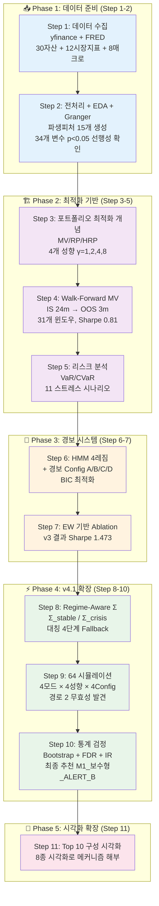
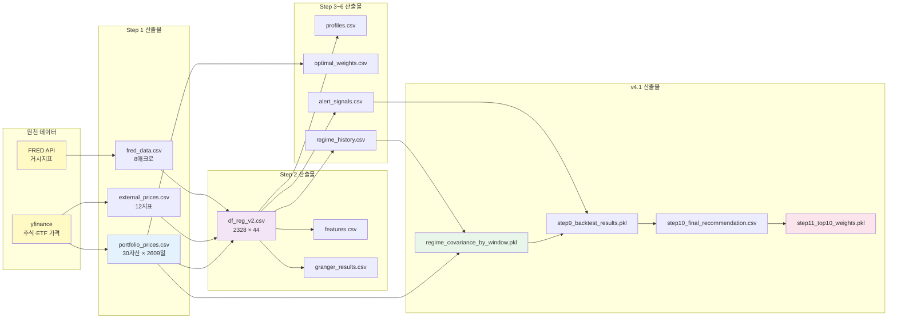

# 🗺️ 파이프라인 플로우차트 — Step 1~11 전체 구조

> **독자**: 프로젝트 이해를 원하는 모든 독자 (균형 톤)
> **목적**: 11단계 파이프라인을 한 장 다이어그램으로

---

## 📊 전체 파이프라인 (Mermaid 다이어그램)



---

## 📦 데이터 흐름 다이어그램



---

## 🎯 단계별 핵심 역할 요약

| Step | 역할 | 핵심 산출 |
|------|------|---------|
| **1** | 원천 데이터 확보 | `portfolio_prices.csv` |
| **2** | 피처 공학 + 선행성 검증 | `df_reg_v2.csv` |
| **3** | 최적화 개념 시연 | `profiles.csv`, `optimal_weights.csv` |
| **4** | MV baseline 성과 (WF) | `wf_results.pkl` |
| **5** | 리스크 정량화 | `risk_metrics.csv` |
| **6** | HMM 레짐 + 경보 신호 | `regime_history.csv`, `alert_signals.csv` |
| **7** | v3 Ablation (EW 기반) | `step7_results.pkl` |
| **8** | 레짐 조건부 공분산 | `regime_covariance_by_window.pkl` |
| **9** | 통합 백테스트 (64 전략) | `step9_backtest_results.pkl` |
| **10** | 통계 검정 + 최종 추천 | `step10_final_recommendation.csv` |
| **11** | Top 10 시각적 해부 | `step11_top10_weights.pkl` |

---

## 🔄 의존성 계층 (5-tier)

```
Tier 0 (원천):      yfinance + FRED
Tier 1 (Step 1):    원본 가격 CSV
Tier 2 (Step 2-3):  피처 + 프로파일
Tier 3 (Step 4-7):  v3 결과 (EW 기반)
Tier 4 (Step 8-10): v4.1 통합 결과
Tier 5 (Step 11):   시각화·해부
```

**위 → 아래 의존**: 각 Tier는 상위 Tier 산출물 필요
**병렬 가능 Step**: Step 3과 Step 4 일부, Step 5 일부

---

## ⏱️ 전체 실행 시간 (순차)

| Step | 시간 | 누적 |
|------|------|------|
| Step 1 | 3~5분 | 5분 |
| Step 2 | 10~15분 | 20분 |
| Step 3 | 3~5분 | 25분 |
| Step 4 | 5~8분 | 33분 |
| Step 5 | 3~5분 | 38분 |
| Step 6 | 5~10분 | 48분 |
| Step 7 | 3~5분 | 53분 |
| Step 8 | 5~10분 | 63분 |
| Step 9 | 10~18분 | 81분 |
| Step 10 | 3~5분 | 86분 |
| Step 11 | 3~5분 | **91분 (약 1.5시간)** |

---

## 📚 상세 참조

각 Step의 상세 내용은 `docs/Step{n}_해설.md` 참조
전체 프로젝트 요약은 `report_final.md` 참조
