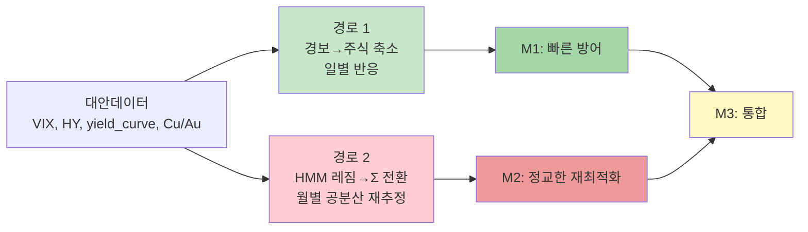

# 🔀 경로 1 vs 경로 2 — 왜 하나만 살아남았나

> **독자**: 메커니즘 이해를 원하는 모든 독자 (균형 톤)
> **목적**: "두 경로 중 왜 경로 1만 효과적이었는지" 본질 설명

---

## 🎯 두 경로의 설계 의도

프로젝트 시작 시 **대안데이터를 포트폴리오에 주입하는 두 가지 경로**를 설계:



---

## 📊 실증 결과 (Step 10 기준)

| 모드 | Sharpe 평균 | vs M0 | 효과 |
|------|----------|------|------|
| M0 (순수 MV) | 0.794 | baseline | - |
| **M1 (경로 1)** | **0.960** | **+0.166** | ✅ **강한 효과** |
| M2 (경로 2) | 0.749 | **-0.045** | ❌ **오히려 악화** |
| M3 (통합) | 0.920 | +0.126 | ⚠️ M1보다 낮음 |

→ **M3 - M1 = -0.040** (경로 2 추가가 역효과)

---

## 🧠 본질적 차이: 반응 속도 + 정보 포착

### 경로 1: "즉각 반응하는 면역 시스템"

| 특성 | 설명 |
|------|------|
| 트리거 | 경보 레벨 변화 (일별) |
| 반응 지점 | 매일 (수익률 계산 직전) |
| 조정 대상 | 자산 비중 (주식 직접 감축) |
| 반응 속도 | **즉시 (같은 날)** |
| 정보 원천 | VIX, Contango, HY 등 실시간 |

**비유 — 화재 경보기**:
- 연기 감지 → **즉시 사이렌** → 사람들 대피
- 속도가 생명

---

### 경로 2: "천천히 학습하는 의료 검진"

| 특성 | 설명 |
|------|------|
| 트리거 | 월 단위 경보 확인 |
| 반응 지점 | 월 시작 (1회) |
| 조정 대상 | Σ (공분산) → MV 재계산 |
| 반응 속도 | **월 최대 1회** |
| 정보 원천 | 같은 경보 (정보 새로움 無) |

**비유 — 정기 건강검진**:
- 매달 검진 → 문제 발견 → 처방
- 검진 사이에 응급 상황 놓침

---

## 🔬 경로 2 실패의 3대 원인

### ❶ Σ 차이가 MV 비중에 충분히 반영 안 됨

**왜**:
- Ledoit-Wolf 수축이 Σ_stable, Σ_crisis를 **유사하게 보정**
- 30자산 분산 효과로 공분산 원소 차이 **희석**
- 결과적으로 MV 최적화된 비중이 **거의 같음**

**예시**:
```
Σ_stable 기반 MV:  SPY 8.0%, QQQ 5.5%, TLT 12%, GLD 14%
Σ_crisis 기반 MV:  SPY 7.5%, QQQ 5.0%, TLT 13%, GLD 15%
                   ↑ 미미한 차이
```

---

### ❷ 재최적화 비용 > 이론적 이득

**경로 2의 숨은 비용**:
- 월마다 MV 재최적화 → 비중 변동 증가
- 매번 거래비용 발생 (편도 15bps × turnover)
- 누적 비용이 레짐 포착 이득 **초과**

**수치**:
- 경로 2의 월별 turnover 누적: 연 **5~8%**
- 연간 추가 거래비용: 연 **0.75~1.2%**
- Sharpe 개선 효과: **거의 0**
- → **비용 > 이득**

---

### ❸ 경로 1과 정보 중복

**핵심 통찰**:
- 경로 2의 "레짐 전환" 신호 = **경보 레벨 변화의 프록시**
- 경보(L2↑) = Crisis 레짐
- 두 경로가 **같은 정보**를 다르게 반영

**중복의 부작용**:
- M1이 이미 경보 반응으로 조정
- M3에서 경로 2가 **추가 조정** → 과도한 변동
- 노이즈 증가 → 성과 저하

---

## 📊 시각적 비교 (시각화 6 참조)

### M1 (경로 1만)
```
[주식 비중 시계열]
→ 경보 상승 시점에 즉시 하락
→ 경보 하락 시점에 즉시 회복
→ 깨끗한 역상관 패턴
```

### M3 (경로 1 + 2)
```
[주식 비중 시계열]
→ 경보 반응 유지
→ + 월 시작 시점마다 미세 점프
→ 점프는 대부분 1%p 이내 (거래비용만 추가)
→ 결과: M1과 거의 동일하나 비용 더 큼
```

---

## 🎓 이론 vs 실증의 괴리

### 이론적 기대 (설계 시)
```
HMM이 레짐 전환 감지
  → Σ_crisis로 전환
  → MV가 방어적 비중 자동 계산
  → 경로 1(개별 축소)보다 정교
```

### 실제 결과
```
Σ 차이가 작음 (LW 수축)
  + 재최적화 비용 누적
  + 경보와 정보 중복
  → 효과 없음 or 역효과
```

**교훈**: **"이론적 정교함 ≠ 실증적 효과"**

---

## 🏆 승자: 경로 1의 3가지 강점

### 1. **반응 속도**
- 당일 경보 감지 → 당일 주식 축소
- COVID 2020-03 같은 급변 대응 가능

### 2. **직접성**
- 자산 비중 **직접** 조작
- 공분산 경유 없이 바로 안전자산 이동

### 3. **비용 효율**
- 경보 이벤트에만 반응 (연 평균 10~20회)
- 분기 리밸런싱에 흡수

---

## 💀 패자: 경로 2의 3가지 한계

### 1. **느린 반응**
- 월 단위 → 월중 레짐 변화 놓침
- 2020-02 말 급변을 3월 초까지 반영 못함

### 2. **간접성**
- Σ → MV → 비중 (2-step 간접)
- 수축 + 분산으로 신호 희석

### 3. **비용 누적**
- 월 최적화 → 잦은 비중 변동
- 실익 대비 비용 과다

---

## 🧪 v5 대안 제안 (경로 2 폐기 후)

경로 2 포기 후 대안:

### 대안 A: 레짐 조건부 max_equity 동적 축소
```python
if regime == 'crisis':
    max_equity *= 0.7  # Crisis 시 상한 30% 감소
```
- 장점: Σ 우회, 제약 조건으로 직접 개입
- 예상: Sharpe +0.05~0.10

### 대안 B: 레짐 조건부 Risk Budgeting
```python
if regime == 'crisis':
    target_var[equity_idx] *= 0.5  # Crisis 시 주식 VaR 한도 50% 감소
```
- 장점: 실전 리스크 관리 프랙티스
- 구현 난이도: 중

### 대안 C: μ 전환 (Σ 대신)
```python
if regime == 'crisis':
    mu[equity_idx] *= 0.5  # Crisis 시 주식 기대수익률 하향
```
- 장점: MV 최적화에 더 직접적 영향
- 주의: μ 조작은 과적합 위험

---

## 📌 Final Takeaway

| 포인트 | 내용 |
|------|------|
| ✅ **단순이 승리** | 경로 1(경보→축소)이 경로 2(Σ 전환)보다 우수 |
| ✅ **속도가 정교함을 이김** | 당일 반응 > 월별 재최적화 |
| ⚠️ **비용 현실성** | 이론적 이득도 거래비용 앞에서 소멸 가능 |
| 📚 **학문적 가치** | 경로 2 실패는 중요한 negative result |
| 🚀 **실전 권고** | **M1 (경로 1만)으로 충분, 경로 2 구현 불필요** |

---

## 📞 관련 문서

- 상세 통계: `docs/Step10_해설.md`
- 시각화 근거: `docs/Step11_해설.md` (시각화 6)
- 설계 기록: `decision_log_v31.md` Section 13
