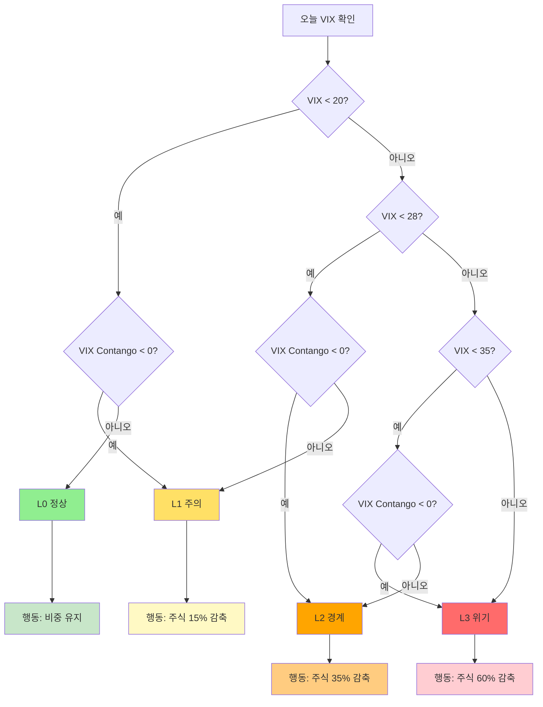

# 🌳 의사결정 트리 — 경보 발동 시 행동 요령

> **독자**: 실전 운용자 / 비전문가 투자자
> **목적**: "오늘 경보가 울렸다. 나는 뭘 해야 하나?" 즉시 답
> **기준 전략**: M1_보수형_ALERT_B (최우수 추천)

---

## 🚦 경보 레벨별 즉시 행동

### 📍 STEP 1: 오늘의 VIX와 VIX Contango 확인



---

## 🎬 경보 레벨별 구체 행동

### 🟢 L0 (정상) — 평상시

| 상황 | 행동 |
|------|------|
| VIX < 20 AND Contango ≥ 0 | 현재 비중 유지 |
| 리밸런싱 | 분기에만 (3개월마다 1회) |

**비중 예시** (보수형):
- 주식 ~40% / 채권 ~45% / 금 ~15%

---

### 🟡 L1 (주의) — 가벼운 위험 신호

| 상황 | 행동 |
|------|------|
| VIX 20~28 OR Contango < 0 | 주식 **15% 감축** |

**구체 재배분**:
- 주식 감축분 × 70% → 채권
- 주식 감축분 × 30% → 금 (GLD)

**예시 (보수형)**:
- 주식 40% → **34%** (-6%p)
- 채권 45% → **49%** (+4%p, = 6% × 70%)
- 금 15% → **17%** (+2%p, = 6% × 30%)

---

### 🟠 L2 (경계) — 중요 위험 신호

| 상황 | 행동 |
|------|------|
| VIX 28~35 | 주식 **35% 감축** |

**예시 (보수형)**:
- 주식 40% → **26%** (-14%p)
- 채권 45% → **55%** (+10%p)
- 금 15% → **19%** (+4%p)

**주의**: 이 레벨이 **2일 이상 지속** 시 본격적 방어 태세

---

### 🔴 L3 (위기) — 심각한 위험 신호

| 상황 | 행동 |
|------|------|
| VIX ≥ 35 | 주식 **60% 감축** |

**예시 (보수형)**:
- 주식 40% → **16%** (-24%p)
- 채권 45% → **62%** (+17%p)
- 금 15% → **22%** (+7%p)

**역사적 사례**:
- 2020-03 COVID (VIX 82)
- 2018-02 Volmageddon (VIX 50)
- 2024-08 엔캐리 청산 (VIX 60)

---

## 🔄 경보 해제 시 복원

### 📉 L3 → L2 → L1 → L0 (점진 완화)

| 단계 | 행동 |
|------|------|
| 경보 하락 당일 | **즉시 복원** (점진 복원은 미구현) |
| 위험 요인 | 복원 직후 재위기 시 whipsaw 발생 가능 |

**v4.2 개선 예정**: 최소 유지 기간 3일 적용 → whipsaw 방지

---

## 📅 분기 리밸런싱 (경보와 별도)

### 매 3개월마다 (1월/4월/7월/10월 초)

1. **IS 24개월 데이터 추출** (최근 2년)
2. **μ (기대수익률)** 계산: 일별 평균 × 252
3. **Σ (공분산)** 계산: Ledoit-Wolf 수축
4. **MV 최적화** 실행 (γ=8, max_equity=43%, min_bond=31%)
5. 새 비중으로 리밸런싱

**거래비용**: 편도 15bps × turnover

---

## 🎨 성향별 감축 강도 비교

| 성향 | L1 감축 | L2 감축 | L3 감축 | 특징 |
|------|--------|--------|--------|------|
| **보수형 (γ=8)** | 15% | 35% | **60%** | 가장 방어적 |
| 중립형 (γ=4) | 10% | 25% | 50% | 균형 |
| 적극형 (γ=2) | 5% | 15% | 35% | 공격 유지 |
| 공격형 (γ=1) | 0% | 10% | 25% | 최소 방어 |

---

## ⚠️ 주의사항

### ❌ 피해야 할 실수

1. **"L1 경보라니 무서워, 다 팔자"** → 규칙 무시, 감정적 대응
2. **"경보 없으니 공격적으로"** → 리스크 한도(max_equity) 초과
3. **"VIX 찾기 귀찮아"** → 자동화 필수
4. **"거래비용 무시"** → 월 10회 이상 전환 시 성과 잠식

### ✅ 권장 실천

1. **매일 장 시작 10분 전** VIX 확인 루틴
2. **자동 알림 설정** (yfinance API 연동)
3. **월 1회 성과 점검** (checklist 13번 참조)
4. **감정 배제, 규칙 준수**

---

## 🧮 빠른 계산기

### Python (간단 함수)

```python
def get_alert_level(vix_level, vix_contango):
    """VIX 기반 경보 레벨 (Config B)"""
    # 기본 레벨 (Config A)
    if vix_level >= 35: level = 3
    elif vix_level >= 28: level = 2
    elif vix_level >= 20: level = 1
    else: level = 0
    
    # Contango 조정 (Config B)
    if vix_contango < 0:
        level = min(level + 1, 3)
    return level


def conservative_action(alert_level, current_equity):
    """보수형 경보 대응"""
    cuts = {0: 0.0, 1: 0.15, 2: 0.35, 3: 0.60}
    cut = cuts[alert_level]
    equity_reduction = current_equity * cut
    return {
        'equity_reduction': equity_reduction,
        'to_bond': equity_reduction * 0.70,
        'to_gold': equity_reduction * 0.30,
        'new_equity': current_equity - equity_reduction,
    }
```

---

## 📞 관련 자료

- **실전 체크리스트**: `quick_reference/13_operating_checklist.md`
- **경보 시스템 상세**: `docs/Step6_해설.md`
- **위기 사례**: `quick_reference/08_crisis_case_studies.md`
