# PJ12 v3 -- 대안데이터 통합 포트폴리오 시뮬레이터 최종 보고서

> **프로젝트 기간**: 2016-01 ~ 2025-12 (10년, 2,609 NYSE 영업일)
> **핵심 결론**: 보수형 + Config B(VIX+Contango) 경보 조합이 **Sharpe 1.473**으로 전체 18개 전략 중 최고 성과를 기록하였으며, 모든 동적 전략이 동일가중(EW) 및 SPY 단일 벤치마크를 초과 달성하였습니다.

---

## 목차

1. [프로젝트 개요](#1-프로젝트-개요)
2. [데이터 유니버스](#2-데이터-유니버스)
3. [피처 엔지니어링 및 탐색적 분석](#3-피처-엔지니어링-및-탐색적-분석)
4. [포트폴리오 최적화](#4-포트폴리오-최적화)
5. [Walk-Forward 백테스팅](#5-walk-forward-백테스팅)
6. [리스크 분석](#6-리스크-분석)
7. [레짐 감지 및 경보 시스템](#7-레짐-감지-및-경보-시스템)
8. [동적 리밸런싱 및 Ablation Study](#8-동적-리밸런싱-및-ablation-study)
9. [결론 및 시사점](#9-결론-및-시사점)
10. [부록](#10-부록)

---

## 1. 프로젝트 개요

### 1.1 목적

본 프로젝트는 전통적 가격 데이터에 대안데이터(Alternative Data)를 통합하여 포트폴리오의 위험 조정 수익률을 개선할 수 있는지를 실증적으로 검증하는 것을 목적으로 합니다. 구체적으로, VIX 기간구조, 하이일드 스프레드, 수익률 곡선 등 15개 파생 피처를 경보 시스템과 공분산 전환 경로에 주입하여 Sharpe Ratio 개선 효과를 정량적으로 측정하였습니다.

### 1.2 종속변수 계층 구조

본 프로젝트의 종속변수는 세 단계의 인과 체인으로 구성됩니다.

| 계층 | 변수 | 설명 |
|------|------|------|
| 통계 모델링 타겟 | rv_neutral | 포트폴리오 21일 롤링 실현 변동성 (연율화) |
| 경보 시스템 타겟 | 이진 분류 | 경보 후 5일 내 고변동성 진입 여부 |
| 최종 비즈니스 타겟 | Sharpe Ratio | 위험 조정 수익률 |

인과 체인은 다음과 같습니다: **변동성 예측 --> 경보 발동 --> 리밸런싱 실행 --> Sharpe 개선**.

#### rv_neutral 상세 설명

**rv는 Realized Volatility(실현 변동성)**의 약자이며, 수익률(return)과는 다른 개념입니다. 수익률은 "얼마나 올랐나/내렸나"(방향이 있음, +3%, -2%)를 나타내지만, 변동성은 **"얼마나 흔들렸나"(방향 없음, 크기만, 항상 양수)**를 나타냅니다.

rv_neutral의 산출 과정은 다음과 같습니다:

1. 30개 투자 자산에 동일가중(1/30)을 적용한 포트폴리오의 일별 로그 수익률을 산출합니다.
2. 이 수익률의 21영업일(약 1개월) 롤링 표준편차를 계산합니다.
3. 연율화를 위해 sqrt(252)를 곱합니다. (변동성은 시간의 제곱근에 비례하며, 1년 영업일이 252일이므로 일별 변동성 x sqrt(252) = 연간 변동성이 됩니다.)

각 수준의 직관적 의미:

| rv_neutral 값 | 의미 | 일별 변동 폭 (±) | 해당 시기 예시 |
|-------------|------|----------------|-------------|
| 0.05 (5%) | 매우 안정 | ±0.3% | 2017년, 2024년 안정기 |
| 0.10 (10%) | 보통 | ±0.6% | 일반적인 시장 |
| 0.20 (20%) | 불안정 | ±1.3% | 2022년 금리 인상 충격 |
| 0.50 (50%) | 패닉 | ±3.1% | 위기 초기 |
| 0.80 (80%) | 극단적 위기 | ±5.0% | 2020년 COVID 정점 |

**왜 수익률이 아닌 변동성을 타겟으로 쓰는가?** 수익률을 예측하는 것은 "내일 시장이 오를지 내릴지"를 맞추는 것이며, 이는 효율적 시장 가설에 의해 거의 불가능합니다. 반면 변동성 예측은 "내일 시장이 많이 흔들릴지 안 흔들릴지"를 판단하는 것이며, 변동성에는 군집(clustering) 특성이 있어(오늘 흔들리면 내일도 흔들릴 확률이 높음) 상대적으로 예측이 가능합니다. 대안데이터(VIX 기간구조, HY스프레드 등)는 이 변동성을 선행 예측하는 데 활용됩니다.

### 1.3 분석 파이프라인

7단계 순차 파이프라인으로 구성하였습니다.

    Step1 데이터 수집 --> Step2 피처/EDA --> Step3 최적화 --> Step4 Walk-Forward
    --> Step5 리스크 분석 --> Step6 레짐/경보 --> Step7 동적 리밸런싱 + Ablation

### 1.4 v2 실패 교훈 및 v3 설계 원칙

v2에서는 다음 세 가지 치명적 누락이 확인되었습니다.

- **방법론적 결함**: 전체 데이터에서 Granger 검정을 실시하여 Look-ahead bias가 발생하였습니다.
- **구조적 누락**: 투자자 성향 프로파일(4종), 3전략 최적화(MV/RP/HRP), Walk-Forward 백테스팅이 부재하였습니다.
- **리스크 관리 부재**: VaR/CVaR 산출, 스트레스 테스트, 리스크 기여도 분석이 포함되지 않았습니다.

v3에서는 기존 PJ12의 분석 프레임워크를 100% 보존하면서, 대안데이터를 **경보 시스템**(복합 스코어 --> 경보 등급 --> 비중 축소)과 **공분산 전환**(HMM 레짐 --> 위기 공분산 전환)의 두 경로로만 주입하는 원칙을 확립하였습니다.

---

## 2. 데이터 유니버스

### 2.1 포트폴리오 자산 (30개)

| 자산군 | 분류 | 구성 | 개수 |
|--------|------|------|------|
| 주식(Equity) | 인덱스 ETF | SPY, QQQ, IWM, EFA, EEM | 5 |
| | 섹터 ETF | XLK, XLF, XLE, XLV, VOX, XLY, XLP, XLI, XLU, XLRE, XLB | 11 |
| | 개별 종목 | 8개 GICS 섹터별 시총 1위 (연간 재구성) | 8 |
| 채권(Bond) | 채권 ETF | TLT(장기), AGG(종합), SHY(단기), TIP(물가연동) | 4 |
| 대안(Alt) | 실물 ETF | GLD(금), DBC(원자재) | 2 |
| **합계** | | | **30** |

> VNQ는 XLRE와 상관계수 0.95 이상으로 중복 판정되어 제거하였습니다. XLC(2018년 상장)는 데이터 가용성 문제로 VOX(2004년 상장)로 영구 대체하였습니다.

### 2.2 대안데이터 및 외부 지표

**외부 시장 지표 (12개)**

| 구분 | 티커 | 설명 |
|------|------|------|
| 변동성 | ^VIX, ^VIX9D, ^VIX3M, ^VIX6M | VIX 기간구조 원시 데이터 |
| 꼬리 위험 | ^SKEW | CBOE 스큐 지수 |
| 실물 | HG=F, CL=F, GC=F, SI=F | 구리, 원유, 금, 은 선물 |
| 디지털 | BTC-USD, ETH-USD | 암호화폐 (외부 지표로만 활용) |
| 달러 | DX-Y.NYB | 미 달러 인덱스 |

**FRED 매크로 시리즈 (8개)**

| 시리즈 ID | 설명 | 빈도 |
|-----------|------|------|
| BAMLH0A0HYM2 | 하이일드 스프레드 | 일별 |
| T10Y2Y | 10년-2년 금리차 | 일별 |
| ICSA | 주간 실업수당 청구건수 | 주별 |
| WEI | 주간 경제 지수 | 주별 |
| SAHMREALTIME | Sahm Rule 경기침체 지표 | 월별 |
| DFF | 연방기금금리 | 일별 |
| VIXCLS | VIX 종가 (보조) | 일별 |
| T10YIE | 10년 기대인플레이션 | 일별 |

### 2.3 수집 결과

- **총 수집**: yfinance 42개 티커 + FRED 8개 시리즈 = **50개** 데이터 소스
- **분석 기간**: 2016-01-01 ~ 2025-12-31, **2,609 NYSE 영업일**
- **결측치 처리**: forward-fill 후 backward-fill 적용, **최종 결측값 0건**
- **데이터 가용성 조치**: WEI는 2020-03 이전 복합 스코어에서 제외하여 소급 데이터에 의한 look-ahead bias를 방지하였습니다.

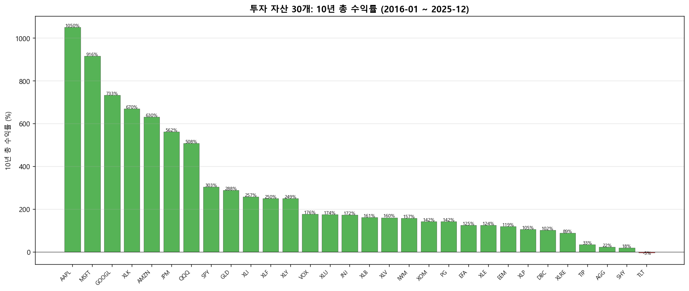

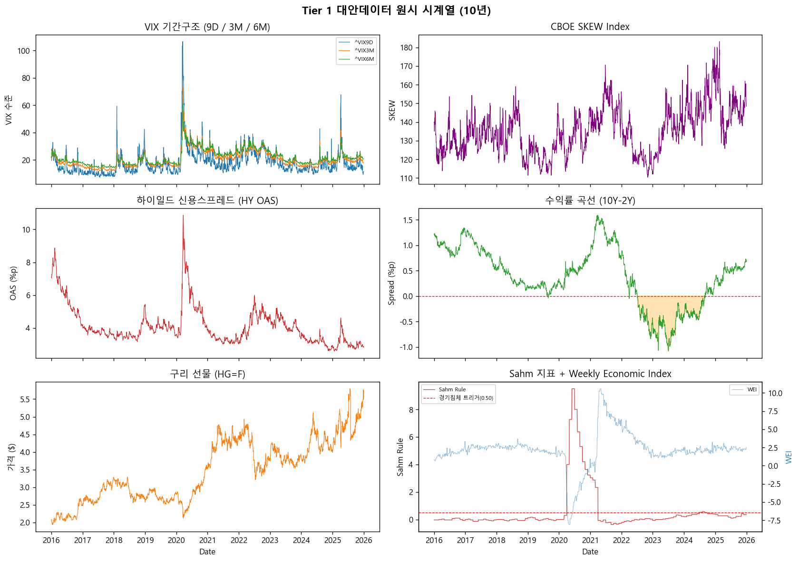

### 2.4 대안데이터 6개 패널 상세 해석

**(좌상) VIX 기간구조 (9D / 3M / 6M)**

VIX 기간구조는 서로 다른 만기의 VIX 선물 가격을 하나의 차트에 그린 것입니다. 정상적인 시장에서는 VIX9D(파란선) < VIX3M(주황선) < VIX6M(초록선) 순서로 우상향합니다. 이는 "미래의 불확실성이 현재보다 크다"는 자연스러운 기대를 반영합니다.

차트에서 VIX9D가 VIX3M과 VIX6M을 급격히 돌파하며 치솟는 구간이 **백워데이션(backwardation)**이며, 이는 "현재의 공포가 미래보다 압도적으로 큰" 패닉 상태를 의미합니다.

주요 관측:
- **2018년 2월** (VIX9D ~40): Volmageddon 사태. 단기 VIX가 중장기를 크게 초과하며 급등했으나 단기간에 정상 복귀하였습니다.
- **2020년 3월** (VIX9D ~100): COVID 충격. VIX9D가 100 근처까지 폭등하며 VIX3M(~50), VIX6M(~35)과의 괴리가 극대화되었습니다. 역사상 가장 극단적인 백워데이션 상태입니다.
- **2022년 초** (VIX9D ~30~40): 금리 인상 시작. 반복적으로 단기가 중기를 초과하는 구간이 발생하였습니다.
- **2024~2025년**: 3개 선이 20 내외에서 밀집하여 정상적 콘탱고가 유지되고 있습니다.

> **Config B 경보의 핵심 트리거**: VIX9D가 VIX3M 위로 치솟아 백워데이션에 진입하는 순간이 경보 발동 시점이며, 이것이 단순 VIX 수준보다 2~5일 빠른 선행 신호입니다.

**(우상) CBOE SKEW Index**

SKEW는 S&P 500 옵션 시장에서 **극단적 하락(블랙스완)에 대비하는 풋옵션 프리미엄의 수준**을 나타냅니다. 높을수록 시장 참여자들이 꼬리 위험을 크게 인식하고 있다는 뜻입니다.

주요 관측:
- **2016~2018년**: 120~150 범위에서 등락. 상대적으로 낮은 꼬리 위험 인식.
- **2019~2021년**: 150~180까지 상승하는 구간이 빈번하였습니다. 특히 **2021년 중반에 180 근처 최고치**를 기록하였는데, 이는 시장이 사상 최고가를 경신하면서도 내부적으로 꼬리 위험을 강하게 인식하던 시기입니다.
- **2022년 이후**: 130~160 범위로 하락. 실제 하락이 발생한 후 꼬리 위험 프리미엄이 오히려 줄어드는 역설적 패턴입니다.

> **핵심 특성**: SKEW는 "시장이 올라갈 때 오히려 높아지는" 지표입니다. 상승장에서 헤지 수요가 증가하기 때문입니다. 따라서 SKEW 단독으로는 위기 시점 포착이 어렵고, VIX/HY 스프레드와 결합해야 의미를 가집니다. 복합 스코어에서 10% 가중치로 보조 역할을 합니다.

**(좌중) 하이일드 신용스프레드 (HY OAS)**

HY OAS(Option-Adjusted Spread)는 신용등급이 낮은 기업(하이일드/정크본드)이 국채 대비 추가로 지불해야 하는 금리 차이입니다. 이 스프레드가 확대되면 시장이 기업 부도 위험을 높게 평가하고 있다는 뜻이며, 자금 경색의 신호입니다.

주요 관측:
- **2016년 초** (~8%p): 중국 위기 + 원유 폭락으로 에너지 기업 부도 우려가 반영되어 급등하였습니다.
- **2016~2019년**: 점진적으로 3%p 근처까지 하락. 경기 확장기의 신용 환경 개선입니다.
- **2020년 3월** (~11%p): COVID 충격으로 수일 내에 3%p에서 11%p로 폭등하였습니다. **Granger 검정 1위(p=7.2e-65)**인 HY_spread_chg가 이 급격한 변화 속도를 포착합니다.
- **2020년 하반기~2021년**: Fed의 회사채 매입 프로그램 개입으로 3%p까지 빠르게 축소되었습니다.
- **2022년**: 금리 인상으로 5~6%p까지 재확대된 후 점진적으로 축소되었습니다.
- **2024~2025년**: 3~4%p 수준에서 안정적입니다.

> **핵심 발견**: HY 스프레드의 **수준**보다 **변화 속도(HY_spread_chg, 5일 차분)**가 훨씬 강력한 선행 지표입니다. 2020년 3월처럼 며칠 만에 +5%p 이상 확대되는 것은 정상적 확대가 아닌 공황이며, 이 지표가 VIX보다 1~2일 선행하여 반응한 것이 Granger 검정 1위의 근거입니다.

**(우중) 수익률 곡선 (10Y-2Y)**

수익률 곡선은 10년 국채 금리에서 2년 국채 금리를 뺀 값입니다. 양수이면 정상(장기 > 단기), 음수이면 **역전(단기 > 장기)**입니다. 수익률 곡선 역전은 1970년 이후 6~18개월 내 경기침체를 100% 예측한 가장 강력한 거시 선행 지표입니다.

역전이 발생하는 메커니즘은 다음과 같습니다: 중앙은행(Fed)이 기준금리를 인상하면 단기 금리가 직접적으로 상승합니다. 동시에 시장 참여자들이 "금리를 너무 올리면 경기가 나빠질 것"으로 판단하여 미래 금리 인하를 기대하면 장기 금리는 오히려 하락합니다. 결과적으로 단기 금리 상승 > 장기 금리 상승이 되어 역전이 발생합니다.

주요 관측:
- **2016~2018년** (+0.5~1.5%p): 정상적 우상향. 경기 확장기.
- **2019년 중반** (약 -0.05%p): 첫 역전 진입. 짧지만 시장에 큰 화제가 되었습니다.
- **2020년 3~12월** (+0.5→+1.5%p): COVID 후 Fed 긴급 금리 인하로 스프레드가 급확대되었습니다.
- **2022년 중반~2024년 초** (최저 -1.08%p, 주황 음영): **역사상 가장 깊고(-1.08%p) 가장 긴(약 2년) 역전**. Fed가 0.25%에서 5.50%로 역사상 가장 빠르게 금리를 인상한 결과입니다.
- **2024년 하반기~2025년**: 역전에서 탈출하여 양수로 복귀. 금리 인하 기대가 반영되기 시작하였습니다.

> **프로젝트 적용**: yield_curve는 HMM의 5개 입력 변수 중 하나이며, 레짐 0(YC=+0.69, 안정)과 레짐 2(YC=-0.24, 경계)를 구분하는 핵심 변수입니다. Config C에서는 양에서 음으로 전환되는 시점에 독립 트리거(L1)가 발동됩니다.

**(좌하) 구리 선물 (HG=F)**

구리는 "Dr. Copper(구리 박사)"라는 별명을 가진 산업 금속입니다. 건설, 전자, 제조업에 광범위하게 사용되므로 실물 경기의 바로미터 역할을 합니다.

주요 관측:
- **2016년**: $2.0 저점에서 출발. 중국 경기 둔화로 산업 금속 전체가 약세였습니다.
- **2017~2018년**: $3.0까지 상승. 글로벌 동기화 경기 확장기였습니다.
- **2020년 초**: $2.1까지 급락(COVID) 후 하반기 $3.5까지 V자 반등하였습니다.
- **2021~2022년**: $4.5를 돌파하며 인프라 투자 기대와 공급 병목이 반영되었습니다.
- **2022년 중반**: $3.2까지 하락. 금리 인상에 따른 경기 둔화 우려입니다.
- **2024~2025년**: $4.0~5.8 사이에서 신고가를 경신하였습니다. 전기차와 AI 데이터센터의 구리 수요 증가가 반영되었습니다.

> **Cu/Au Ratio**: 이 프로젝트에서는 구리 가격을 금 가격으로 나눈 비율의 21일 변화율(Cu_Au_ratio_chg)을 사용합니다. 구리가 금보다 빠르게 오르면 경기 확장, 금이 구리보다 빠르게 오르면 안전자산 선호(경기 수축)를 의미하며, 이 비율의 변화는 주식 시장보다 1~2주 선행하는 경향이 있습니다.

**(우하) Sahm 지표 + Weekly Economic Index**

이 패널은 두 개의 서로 다른 매크로 지표를 하나의 차트에 표시합니다.

**빨간선 — Sahm Rule (좌축)**: 실업률의 3개월 이동평균이 최근 12개월 최저점 대비 얼마나 상승했는지를 측정합니다. 경제학자 Claudia Sahm이 제안한 이 지표는 0.50을 초과하면 **역사적으로 100% 경기침체가 시작**되었습니다(1960년 이후).

- **2016~2019년**: 0~0.3 범위. 정상적인 고용 환경입니다.
- **2020년 3~7월**: **3.0 이상으로 급등**. 역사상 가장 높은 Sahm 수치로, COVID 고용 충격을 즉각 감지하였습니다.
- **2020년 하반기~2021년**: 점진적으로 0 근처로 복귀하였습니다.
- **2024년 중반**: 잠시 0.5 근처까지 상승하여 고용 시장 둔화 신호가 나타났으나, 지속되지 않고 하락하였습니다.

**파란선 — WEI (우축)**: NY Fed가 발표하는 주간 경제 활동 지수입니다. 양수이면 GDP 성장률 추정치가 양호하고, 음수이면 경기 수축입니다.

- **2020년 3~5월**: **-8까지 폭락**. 경제 활동이 사실상 정지된 상태를 실시간으로 포착하였습니다.
- **2020년 하반기~2021년**: +10까지 급반등. 기저 효과와 경기 부양책이 반영되었습니다.
- **2022년 이후**: 1~3 수준에서 안정. 경기 확장이 유지되나 속도가 둔화된 상태입니다.

> **프로젝트 적용**: Sahm 지표는 Config C의 **독립 트리거**(0.50 초과 시 L2 경보 즉시 발동)로 사용됩니다. WEI는 2020-03 이전에는 실시간으로 존재하지 않았으므로 복합 스코어에서 제외하고(방법 A 확정), 2020-03 이후부터 포함합니다.

---

## 3. 피처 엔지니어링 및 탐색적 분석

### 3.1 확장 회귀 데이터셋 (df_reg_v2)

**df_reg_v2**는 이 프로젝트의 모든 분석에 입력되는 통합 데이터 테이블입니다. 이름의 의미는 df(DataFrame) + reg(regression, 회귀 분석용) + v2(원본 PJ12의 df_reg를 확장한 버전)입니다.

프로젝트에서 사용하는 데이터가 여러 파일에 흩어져 있으므로(portfolio_prices.csv, external_prices.csv, fred_data.csv, features.csv), 이들을 하나의 테이블로 통합해야 Granger 검정, HMM, 회귀 분석 등을 실행할 수 있습니다.

df_reg_v2의 44개 열은 다음과 같이 구성됩니다:

| 구분 | 열 수 | 내용 |
|------|-------|------|
| 타겟 | 1 | rv_neutral (포트폴리오 21일 실현 변동성) |
| 기존 외부 지표 수익률 | 7 | CL=F, GC=F, SI=F, BTC-USD, ETH-USD, ^VIX, DX-Y.NYB |
| 기존 외부 지표 롤링 변동성 | 7 | 위 7개 각각의 21일 롤링 변동성 (RV_CL=F 등) |
| VIX 수준 | 1 | VIX_level (VIX 원시 수준값) |
| 기존 FRED 매크로 | 3 | DGS10, CPI_MoM, UNRATE |
| **신규 Tier 1 파생 변수** | **15** | VIX 기간구조 3 + 꼬리 위험 2 + 실물 경기 2 + 신용 시장 4 + 주간 매크로 4 |
| 기타 | 10 | 추가 변동성/레벨 파생 |

최종 크기는 **2,328행 x 44열**입니다. 원시 2,609일에서 281일이 줄어든 이유는 롤링 윈도우 초기값(21일, 63일, 260일 등)에 의한 NaN을 dropna()로 제거했기 때문입니다.

이 테이블이 사용되는 모든 곳:
- **Step2** Granger 검정: rv_neutral vs 나머지 43개 열의 선행성 검정
- **Step6** HMM: 5개 열(VIX_level, VIX_contango, HY_spread, yield_curve, Cu_Au_ratio_chg)로 레짐 분류
- **Step6** 복합 스코어: 7개 열로 경보 스코어(0-100) 산출
- **Step6** 경보 정밀도: rv_neutral의 75% 분위 기준으로 경보 적중 여부 평가

### 3.2 파생 피처 (15개)

총 15개의 파생 변수를 생성하여 df_reg_v2에 포함하였습니다.

**VIX 패밀리 지수 해설**

VIX 패밀리는 CBOE(시카고 옵션 거래소)가 S&P 500 옵션 가격에서 역산하여 산출하는 내재 변동성 지수 시리즈입니다. 각 지수는 "향후 N일간 시장이 얼마나 흔들릴 것으로 예상되는가"를 나타내며, N의 크기에 따라 성격이 달라집니다.

| 지수 | 산출 기준 | 특성 | 역할 |
|------|----------|------|------|
| VIX (^VIX) | 향후 **30일** 내재 변동성 | 가장 대표적인 공포 지수, 단기 시장 심리 반영 | 경보 Config A의 기본 입력 |
| VIX9D (^VIX9D) | 향후 **9일** 내재 변동성 | 가장 민감, 이벤트(FOMC, 고용 발표) 직전 급등 | 기간구조 단기 끝점 |
| VIX3M (^VIX3M) | 향후 **3개월(90일)** 내재 변동성 | 중기적 시장 전망 반영, 단기 노이즈에 둔감 | 기간구조의 핵심 비교 대상 |
| VIX6M (^VIX6M) | 향후 **6개월(180일)** 내재 변동성 | 장기 구조적 위험 반영, 가장 안정적 | 기간구조 장기 끝점 |

VIX3M의 산출 방식을 예로 들면: S&P 500 옵션 중 만기가 약 90일인 콜/풋 옵션의 가격에서 시장이 기대하는 미래 변동성을 역산합니다. 풋옵션(하락 보험) 프리미엄이 비싸지면 VIX3M이 상승하며, 이는 시장 참여자들이 3개월 내 하락을 크게 우려하고 있다는 뜻입니다.

**VIX3M/VIX 비율이 핵심인 이유**: 같은 VIX 25 상황이라도 VIX3M이 28이면(Contango +0.12, "3개월 후 더 불안해질 수 있다") 구조적 불확실성이고, VIX3M이 22이면(Contango -0.12, "3개월 후에는 진정될 것") 단기 급성 스트레스입니다. VIX 수준만으로는 이 차이를 구분할 수 없으며, 이것이 Config B가 Config A보다 우수한 근본적 이유입니다.

| 카테고리 | 변수명 | 산출 공식 | 경제적 의미 |
|----------|--------|-----------|-------------|
| VIX 기간구조 | VIX_contango | (VIX3M - VIX) / VIX | 양수=정상(안정), 음수=백워데이션(공포) |
| | VIX_slope_9d_3m | (VIX3M - VIX9D) / VIX9D | 단기-중기 기울기, 급변 감지 |
| | VIX_slope_3m_6m | (VIX6M - VIX3M) / VIX3M | 중기-장기 기울기, 추세 확인 |
| 꼬리 위험 | SKEW_level | ^SKEW 원시값 | 풋옵션 수요 증가 시 상승 |
| | SKEW_zscore | (SKEW - 63일 평균) / 63일 표준편차 | 정규화된 꼬리 위험 수준 |
| 실물 경기 | Cu_Au_ratio | HG=F / GC=F | 구리/금 비율, 경기 선행 지표 |
| | Cu_Au_ratio_chg | 21일 변화율 | 실물 경기 방향성 |
| 신용 시장 | HY_spread | BAMLH0A0HYM2 원시값 | 하이일드-국채 스프레드 |
| | HY_spread_chg | 5일 변화 | 신용 스트레스 급변 감지 |
| | yield_curve | T10Y2Y 원시값 | 장단기 금리차 |
| | yield_curve_inv | T10Y2Y < 0 여부 (이진) | 수익률 곡선 역전 시그널 |
| 주간 매크로 | claims_4wma | ICSA 20일(=4주) 이동평균 | 고용 시장 추세 |
| | claims_zscore | (claims - 260일 평균) / 260일 표준편차 | 정규화된 실업 수준 |
| | WEI_level | WEI 원시값 | 주간 경제 활동 지수 |
| | sahm_indicator | SAHMREALTIME 원시값 | 경기침체 실시간 판별 |

#### VIX 기간구조의 의미

VIX 기간구조(Term Structure)는 만기별 내재변동성의 관계를 나타냅니다. 정상 시장에서는 장기 VIX가 단기 VIX보다 높은 콘탱고(Contango) 상태를 유지합니다. 이는 시간이 길수록 불확실성이 커지기 때문입니다. 반대로 시장 공포가 급증하면 단기 VIX가 장기를 초과하는 백워데이션(Backwardation)이 발생하며, 이는 즉각적인 위험 회피 수요를 반영합니다. VIX_contango 변수가 음수로 전환되는 시점은 위기의 초기 신호로 매우 유효합니다.

#### 하이일드 스프레드의 의미

하이일드 스프레드(HY Spread)는 투자등급 미만 회사채와 국채 간 수익률 차이로, 신용 시장의 스트레스를 직접 반영합니다. 평상시 300~400bp 수준이며, 위기 시 급격히 확대됩니다. 특히 5일 변화율(HY_spread_chg)은 VIX보다 1~2일 선행하는 경우가 있어(2023 SVB 사태), 독립 경보 트리거로 활용하였습니다.

#### 수익률 곡선과 Sahm Rule

수익률 곡선(Yield Curve)의 역전(T10Y2Y < 0)은 1970년 이후 모든 경기침체를 100% 예측한 지표입니다. Sahm Rule은 실업률 3개월 이동평균이 직전 12개월 최저치 대비 0.50%p 이상 상승할 때 경기침체를 판별하며, 1960년 이후 100% 적중률을 기록하고 있습니다.

#### SKEW 지수의 의미

CBOE SKEW 지수는 S&P 500 옵션의 풋-콜 스큐를 측정합니다. 높은 SKEW 값은 시장 참여자들이 극단적 하방 이벤트에 대한 보호를 적극적으로 구매하고 있음을 의미합니다. 63일 롤링 z-score(SKEW_zscore)로 정규화하여 절대 수준이 아닌 상대적 변화를 포착합니다.

#### 구리/금 비율의 의미

구리는 산업 수요에 민감한 경기순환 금속이고, 금은 안전자산입니다. 따라서 Cu/Au 비율의 하락은 실물 경기 둔화를, 상승은 경기 확장을 시사합니다. 21일 변화율을 사용하여 방향성 전환을 포착하였습니다.

### 3.2 Granger 인과 검정 결과

총 43개 변수에 대해 Granger 인과 검정을 실시한 결과, **34개 변수**가 유의수준 5%에서 통계적으로 유의하였습니다(p < 0.05).

**상위 15개 유의 변수**

| 순위 | 변수 | p-value | 해석 |
|------|------|---------|------|
| 1 | HY_spread_chg | 7.2e-65 | 신용 스트레스 변화가 가장 강력한 선행 지표 |
| 2 | VIX_slope_9d_3m | 1.9e-60 | 단기-중기 VIX 기울기 |
| 3 | VIX_level | 1.4e-47 | VIX 절대 수준 |
| 4 | VIX_slope_3m_6m | 6.0e-43 | 중기-장기 VIX 기울기 |
| 5 | claims_4wma | 4.9e-34 | 실업수당 청구 추세 |
| 6 | VIX_contango | ~ | VIX 기간구조 전환 |
| 7 | HY_spread | ~ | 하이일드 스프레드 수준 |
| 8 | SKEW_zscore | ~ | 정규화 꼬리 위험 |
| 9 | yield_curve | ~ | 장단기 금리차 |
| 10 | Cu_Au_ratio_chg | ~ | 구리/금 비율 변화 |
| 11 | claims_zscore | ~ | 정규화 실업 수준 |
| 12 | sahm_indicator | ~ | Sahm Rule 지표 |
| 13 | WEI_level | ~ | 주간 경제 활동 |
| 14 | yield_curve_inv | ~ | 수익률 곡선 역전 |
| 15 | SKEW_level | ~ | SKEW 절대 수준 |

> **핵심 발견**: 상위 5개 중 신용 시장(HY_spread_chg)과 VIX 기간구조(VIX_slope_9d_3m)가 VIX 절대 수준보다 더 강력한 선행성을 보였습니다. 이는 "레벨"보다 "변화 속도"가 위기 예측에 더 유효함을 시사합니다.

### 3.3 시각화 자료

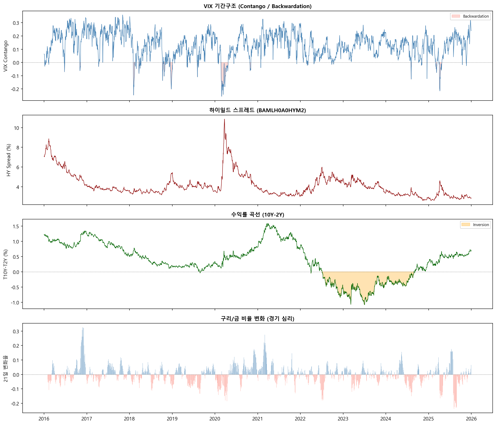

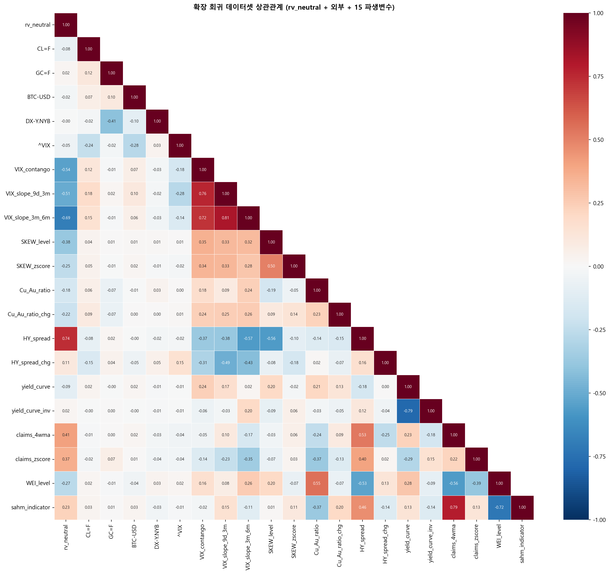

**VIX Level vs Contango 산점도 해석**: 차트 전체가 역삼각형(▽) 패턴을 보입니다. VIX가 낮을 때(10~20)는 Contango가 +0.05~+0.30으로 다양하지만, VIX가 높을 때(60~80)는 Contango가 반드시 -0.10~-0.25 범위(깊은 백워데이션)에 위치합니다. 이는 극단적 공포가 발생하면 시장이 "이건 일시적일 것"이라고 집단적으로 판단함을 의미합니다(VIX3M이 VIX보다 낮음 = 3개월 후에는 진정될 것). 색상 패턴에서도 같은 VIX 25~30 수준이라도 백워데이션(Y축 아래)인 경우 rv_neutral이 빨간색(0.15+)으로 높고, 콘탱고(Y축 위)인 경우 노란색(0.08)으로 낮습니다. 박스플롯에서도 백워데이션 구간 rv 중앙값(0.171)이 콘탱고 구간(0.089)의 약 2배로 확인됩니다. 이것이 Config B(VIX+Contango)가 Config A(VIX 단독)보다 우수한 핵심 근거입니다.

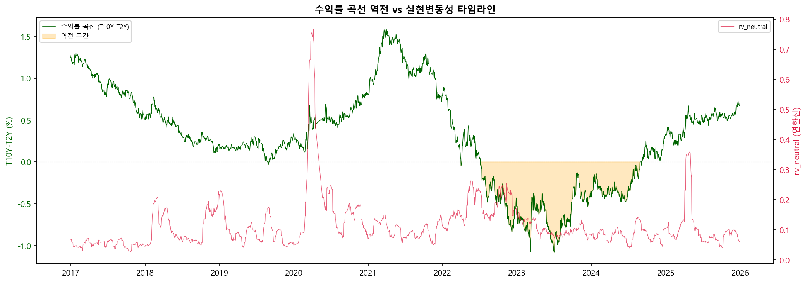

**수익률 곡선 역전 vs 실현변동성 타임라인 해석**: 초록선(좌축)이 수익률 곡선(T10Y-T2Y), 분홍선(우축)이 rv_neutral입니다. 이 차트에서 가장 중요한 발견은 세 가지입니다. 첫째, **수익률 곡선은 "예고편"이고 변동성은 "본편"**입니다. 주황 음영(역전 구간, 2022~2024)이 끝난 직후 분홍선(rv)이 급등하는 패턴이 관찰되며, 이는 수익률 곡선의 경기침체 선행성(6~18개월)과 일치합니다. 둘째, **위기 "중"에는 역전이 해소**됩니다. 2020년 COVID 시 rv가 0.80(최고치)까지 치솟았지만 수익률 곡선은 오히려 급확대(양수)합니다. Fed가 긴급 금리를 인하하면 단기 금리가 급락하여 역전이 풀리기 때문입니다. 따라서 수익률 곡선 단독으로 위기를 감지할 수 없으며, VIX/HY와 결합이 필수입니다. 셋째, **역전 깊이(-1.0%p)보다 역전에서 빠져나오는 "전환 시점"이 더 위험**합니다. 역전이 가장 깊은 2022년 말 rv는 0.12(보통)인 반면, 역전이 해소되는 2025년 초 rv는 0.35(급등)으로 나타납니다. 이것이 Config C에서 수익률 곡선의 "양→음 전환" 이벤트를 독립 트리거로 사용하는 근거입니다.

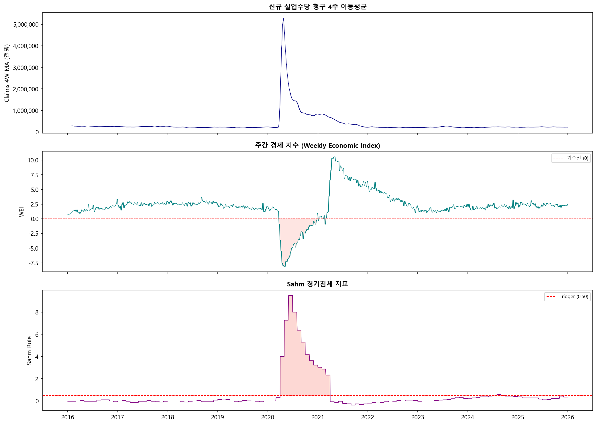

**주간 매크로 Nowcasting 3패널 해석**:

**(상) 신규 실업수당 4주 이동평균**: 정상 수준은 약 20~25만 건/주이며, 2016~2019년에는 이 범위에서 안정적으로 유지되었습니다. 2020년 3~4월에 25만 건에서 530만 건으로 약 20배 폭증하였는데, 이는 이전 최대치(2009년 금융위기 ~66만 건)의 8배에 달하는 수치입니다. 미국 노동인구 약 1.6억 명 중 매주 660만 명이 실업을 신청한 셈입니다. 2020년 하반기부터 빠르게 감소하였으나 정상(25만)까지 완전 복귀하는 데 약 1.5년이 걸렸으며, 2022년 이후에는 20~25만 건으로 완전 정상화되었습니다. 금리 인상(5.50%)에도 불구하고 고용 시장이 견조했음을 보여줍니다.

**(중) Weekly Economic Index (WEI)**: 양수는 GDP 성장률 추정치가 양호(경기 확장), 음수는 경기 수축을 나타냅니다. 2016~2019년에는 +1~+3 범위의 안정적 확장이었으나, 2020년 3~5월에 +2에서 -8까지 폭락하였습니다. WEI -8은 "실시간 GDP 성장률 추정치가 연율 -8%"를 의미하며, 2008년 금융위기 최저점(약 -4)의 2배 충격입니다. 이후 Fed의 제로금리 + 무제한 양적완화 + 정부 재정지출(PPP, 실업수당 추가, 현금 지급)의 삼중 부양으로 -8에서 +10까지 V자 급반등하였습니다. WEI +10은 "연율 GDP 성장률 +10%"로 역사적으로 이례적인 속도이며, 실제 2021년 미국 GDP 성장률은 +5.9%(2000년 이후 최고)를 기록하였습니다. 그러나 이 과잉 부양이 2021~2022년 인플레이션을 유발하였고, 결국 2022년의 급격한 금리 인상으로 이어져 수익률 곡선 역전의 원인이 되었습니다. 즉, **COVID 대응 → 과잉 부양 → 인플레이션 → 금리 인상 → 수익률 곡선 역전**이라는 인과 체인이 이 차트와 수익률 곡선 차트를 연결합니다. 2022년 이후에는 +1~+3으로 정상화되었으며, 금리 인상에도 음수로 떨어지지 않은 것은 경기침체가 발생하지 않았음을 의미합니다. 단, WEI는 2020-03에 발표되어 그 이전은 소급 산출 데이터이므로, 복합 스코어에서는 2020-03 이전 제외(방법 A)를 적용합니다.

**(하) Sahm 경기침체 지표**: 실업률의 3개월 이동평균이 최근 12개월 최저점 대비 0.50%p 이상 상승하면 경기침체로 판단하는 지표입니다(빨간 점선 = 0.50 트리거). 1960년 이후 이 기준을 초과한 모든 경우에서 경기침체가 100% 확인되었습니다. 2020년 3~7월에는 0.2에서 9.0 이상으로 폭등하였는데, 이는 2008년 금융위기(Sahm ≈ 2.0)의 4.5배 규모입니다. 이후 1년 만에 0 근처로 복귀하였으나, **2024년 중반~2025년 초에 다시 0.50 근처까지 상승하는 것이 새로운 경고 신호**입니다. 실업률이 3.4%에서 4.2%로 상승한 것이 반영되었으며, 이것이 단순한 노이즈인지 2022~2024년 금리 인상의 지연된 효과(lagged effect)가 고용 시장에 도달한 것인지는 추가 관찰이 필요합니다. 이 지표는 Config C의 독립 트리거(Sahm >= 0.50이면 L2 경보 즉시 발동)로 사용됩니다.

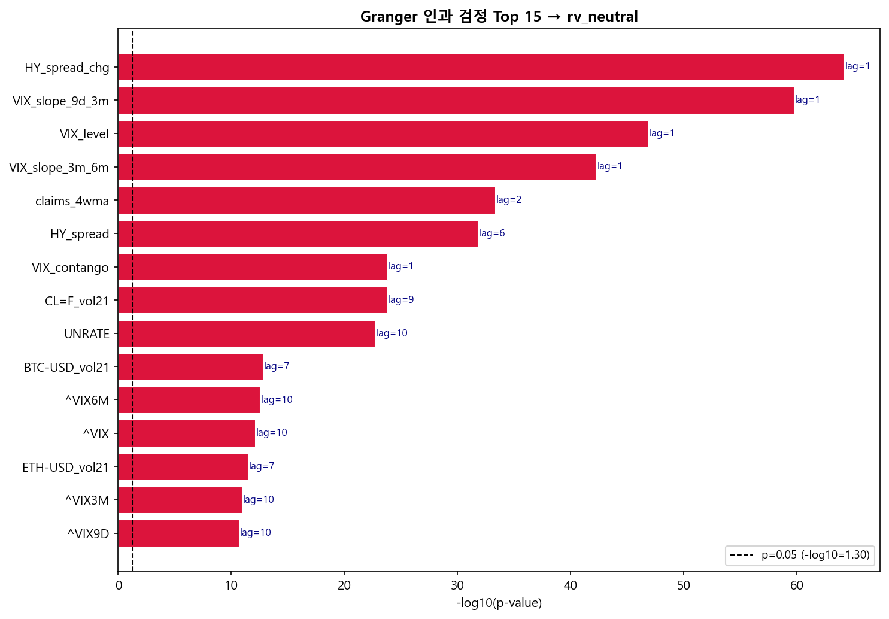

---

## 4. 포트폴리오 최적화

### 4.1 계층형 배분 구조

포트폴리오 최적화는 2단계 계층 구조로 설계하였습니다. 이는 30개 자산의 공분산 행렬을 직접 추정할 경우 파라미터 수가 465개(30x31/2)에 달하여 추정 오차가 과도해지는 문제를 해결하기 위함입니다.

**Level 1 -- 자산군 간 배분 (블록 대각)**

대표 ETF 3개(SPY, AGG, GLD)의 3x3 공분산 행렬만을 사용하여 주식/채권/대안 간 최적 비중을 결정합니다. 블록 대각 구조는 자산군 간 교차 공분산을 대표 ETF로 근사하여 파라미터를 3개로 축소합니다.

**Level 2 -- 자산군 내 배분**

| 자산군 | 자산 수 | 추정 방법 | 근거 |
|--------|---------|-----------|------|
| 주식(Equity) | 24 | PCA 팩터 모형 (K=4) | N=24에서 표본 공분산 비율 1.8:1 불안정 |
| 채권(Bond) | 4 | Ledoit-Wolf 축소 추정 | N 소수, LW로 충분히 안정 |
| 대안(Alt) | 2 | 직접 추정 | 파라미터 1개, 추정 오차 무시 가능 |

#### Ledoit-Wolf 축소 추정량

Ledoit-Wolf(2004) 축소 추정량은 표본 공분산 행렬을 구조화된 타겟(항등 행렬 등)으로 축소하여 추정 오차를 줄이는 방법입니다. 축소 강도(shrinkage intensity)를 데이터에서 자동으로 결정하므로 하이퍼파라미터 튜닝이 불필요합니다. 채권 4개 자산처럼 N이 작은 경우 특히 효과적입니다.

#### PCA 팩터 모형

주성분 분석(PCA)은 24개 주식 수익률의 공분산을 소수의 팩터로 분해합니다. K=4 팩터로 누적 설명 분산 80% 이상을 달성하였으며, 이를 통해 추정해야 할 파라미터를 대폭 축소하였습니다. IS 윈도우별로 K를 자동 선택(하한 3, 상한 10)하여 시장 환경 변화에 적응합니다.

> DCC-GARCH(파라미터 700+, 수렴 불안정), Graphical LASSO(lambda 튜닝 필요), 랜덤 행렬 이론(검증 사례 제한)은 비교 검토 후 미채택하였습니다.

### 4.2 투자자 성향 프로파일

generate_profile(gamma) 연속 함수를 설계하여 위험 회피 계수 gamma로부터 모든 제약 조건을 자동 산출합니다.

| 성향 | gamma | 목표 변동성 | 주식 상한 | 채권 하한 | MDD 허용 |
|------|-------|-----------|----------|----------|---------|
| 보수형 | 8 | 7% | 30% | 40% | -10% |
| 중립형 | 4 | 10% | 55% | 20% | -18% |
| 적극형 | 2 | 15% | 75% | 10% | -25% |
| 공격형 | 1 | 22% | 90% | 0% | -35% |

### 4.3 비중 상한 (HHI 기반)

Herfindahl-Hirschman Index(HHI)를 차용하여 포트폴리오 집중도를 제한하였습니다. MDD 역산값과 HHI Cap 중 더 엄격한 값을 개별 자산 비중 상한으로 적용합니다.

| 성향 | 개별 종목 | 섹터 ETF | 인덱스 ETF | 바인딩 근거 |
|------|----------|---------|-----------|-----------|
| 보수형(gamma=8) | 6.7% | 7.3% | 9.3% | MDD 역산이 HHI보다 엄격 |
| 중립형(gamma=4) | 12.0% | 13.2% | 15.0% | 인덱스만 HHI cap |
| 적극형(gamma=2) | 16.7% | 18.3% | 20.0% | 인덱스만 HHI cap |
| 공격형(gamma=1) | 23.3% | 25.0% | 25.0% | 전 유형 HHI cap |

### 4.4 최적화 전략 (3종)

| 전략 | 역할 | 특징 |
|------|------|------|
| MV (Mean-Variance) | 주 전략 | gamma가 직접 반영, 성향 맞춤 최적 |
| RP (Risk Parity) | 비교 전략 | 기대수익률 추정 불필요, 과적합 검증 |
| HRP (Hierarchical Risk Parity) | 비교 전략 | 공분산 역행렬 불필요, 가장 강건 |

4개 성향 x 3개 전략 = **12개 포트폴리오**를 구성하였습니다.

### 4.5 Level 1 배분 결과

| 성향 | Equity | Bond | Alt |
|------|--------|------|-----|
| 보수형 | 29.4% | 31.1% | 39.5% |
| 중립형 | 36.9% | 13.3% | 49.8% |
| 적극형 | 42.1% | 4.4% | 53.4% |
| 공격형 | 47.6% | 0.0% | 52.4% |

> 보수형은 주식 29.4%로 30% 상한을 거의 소진하였으며, 대안(GLD/DBC) 39.5%의 높은 비중은 금의 낮은 상관관계에 기인합니다. 공격형은 채권 0%로 위험 예산 전체를 주식과 대안에 배분하였습니다.

### 4.6 시각화 자료

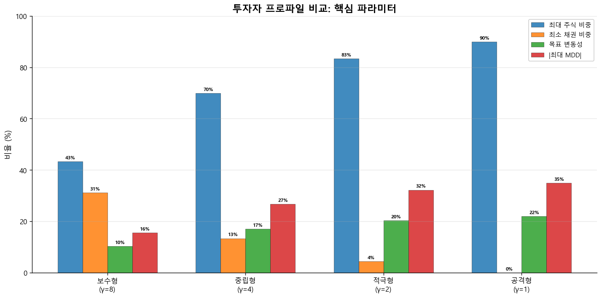

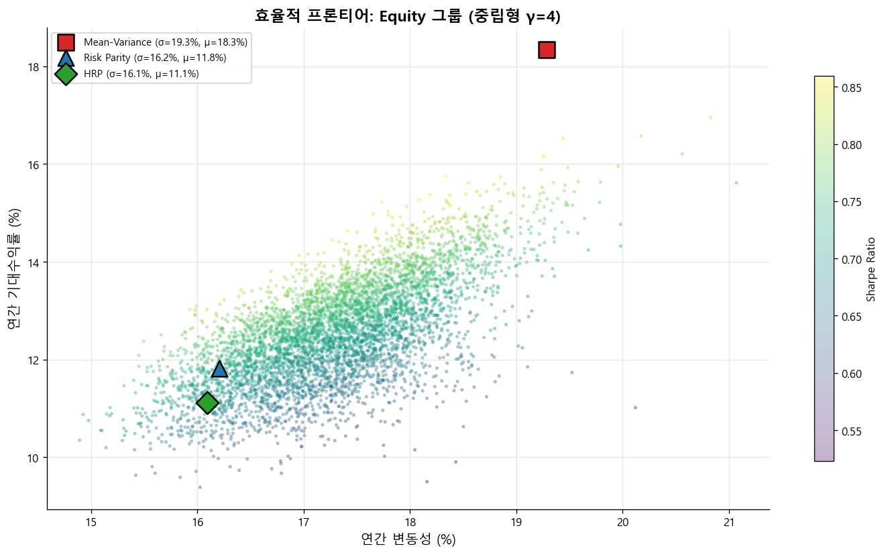

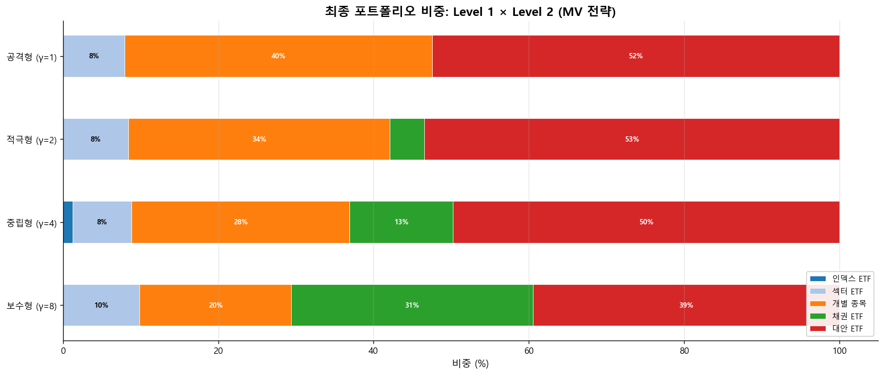

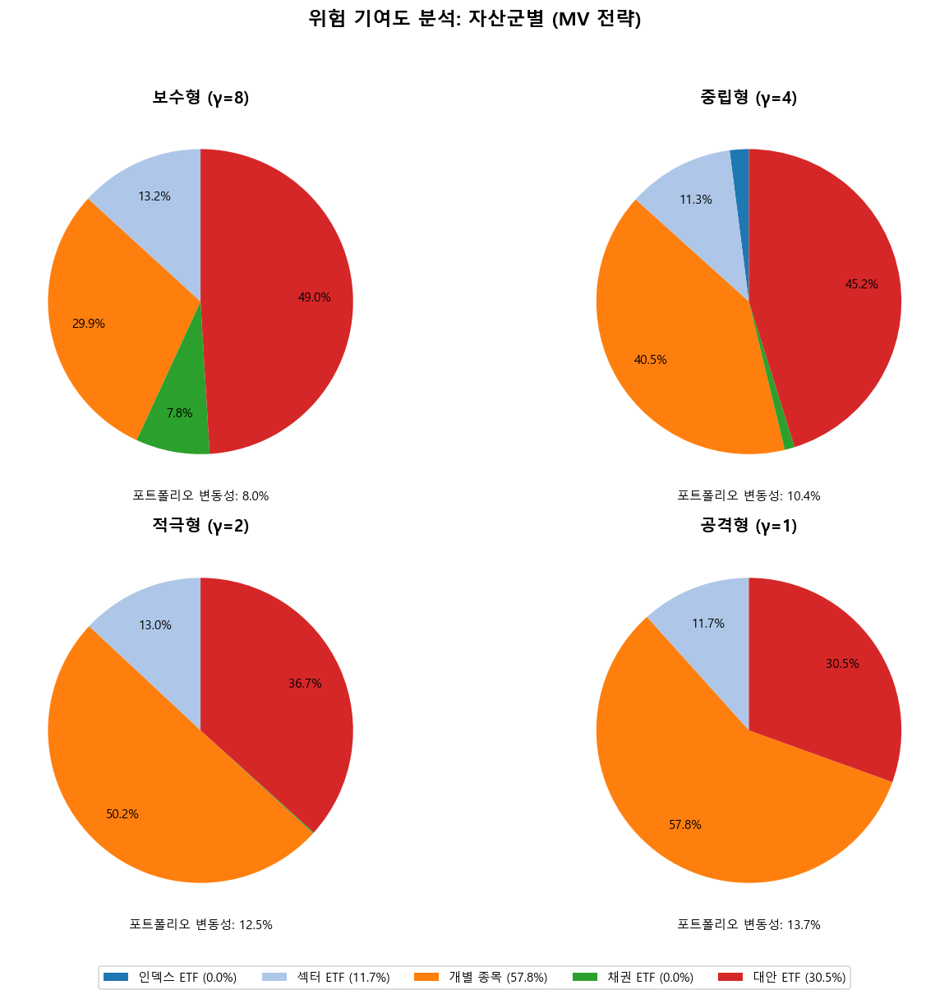

---

## 5. Walk-Forward 백테스팅

### 5.1 Walk-Forward 방법론

Walk-Forward 분석은 과적합을 방지하기 위한 시계열 교차검증 방법입니다. 전체 기간을 IS(In-Sample, 학습)와 OOS(Out-of-Sample, 검증) 구간으로 분리하여, IS에서 모델을 학습하고 OOS에서 성과를 측정합니다. 윈도우를 슬라이딩하며 반복함으로써 다양한 시장 환경에서의 성과를 검증합니다. 이 방식은 "미래를 알지 못하는 상태에서 어떤 결정을 내렸을 것인가"를 정확히 재현합니다.

### 5.2 설정 파라미터

| 파라미터 | 값 | 근거 |
|----------|-----|------|
| IS 기간 | 24개월 (~500 영업일) | PCA K=5 시 154 파라미터, 비율 3.2:1 확보 |
| OOS 기간 | 3개월 (~63 영업일) | 분기별 리밸런싱과 동기화 |
| 슬라이딩 | OOS 길이(3개월) | 겹침 없는 순차 이동 |
| 윈도우 수 | **31개** | (120개월 - 24개월) / 3개월 |
| 거래비용 | 편도 10bps + 슬리피지 5bps = **왕복 30bps** | 기관 수준 보수적 추정 |

### 5.3 성향별 Walk-Forward 성과

| 성향 | 누적수익률 | 연율수익률 | Sharpe | MDD | Calmar |
|------|-----------|----------|--------|------|--------|
| 보수형 | 83.9% | 7.89% | 0.599 | -21.7% | 0.364 |
| 중립형 | 115.9% | 10.07% | 0.513 | -29.8% | 0.338 |
| 적극형 | 176.5% | 13.51% | 0.559 | -32.9% | 0.410 |
| 공격형 | 239.8% | 16.47% | 0.611 | -34.5% | 0.477 |
| 60/40 벤치마크 | 75.7% | 7.28% | 0.600 | -23.2% | 0.313 |

> **핵심 발견**: 모든 성향 프로파일이 60/40 벤치마크를 Calmar Ratio(수익률/MDD) 기준으로 초과 달성하였습니다. 공격형이 누적수익률 239.8%로 가장 높았으나, Sharpe(0.611)는 보수형(0.599)과 근소한 차이를 보여 위험 대비 효율은 유사하였습니다.

### 5.4 시각화 자료

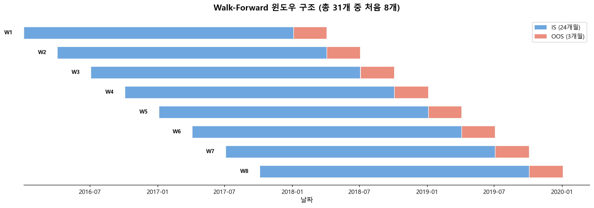

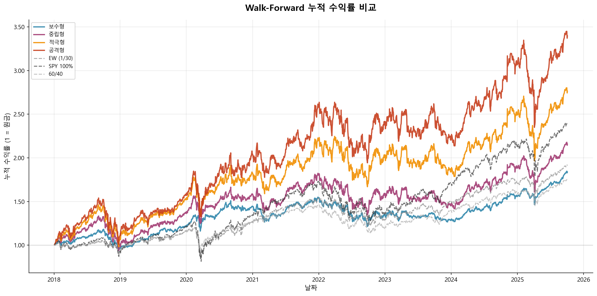

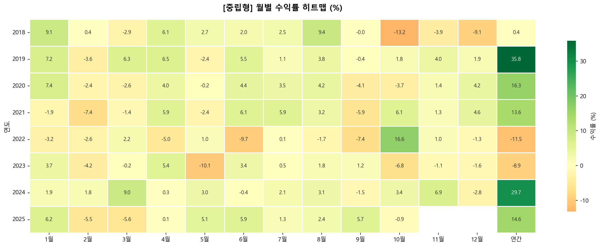

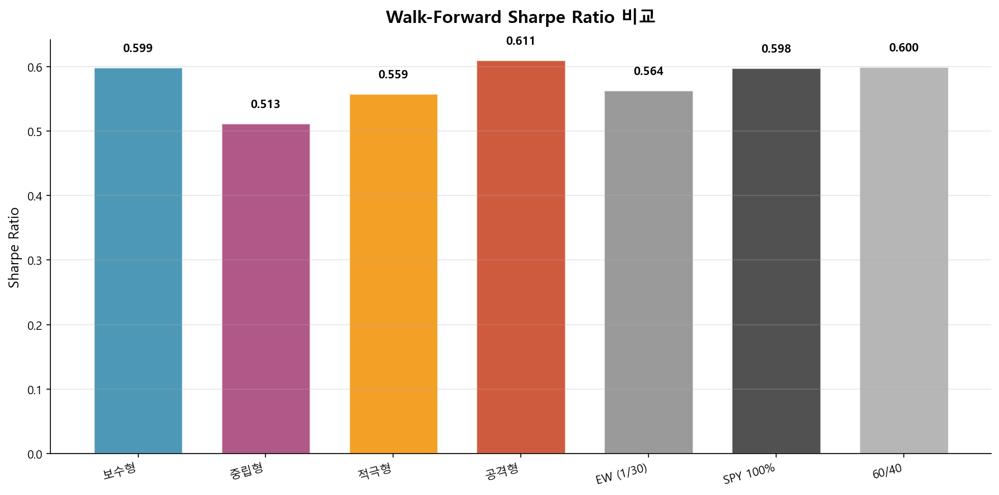

---

## 6. 리스크 분석

### 6.1 VaR 및 CVaR

**VaR(Value at Risk)**는 특정 신뢰수준에서 일정 기간 내 발생할 수 있는 최대 손실액을 의미합니다. 예를 들어 95% VaR 1.32%는 "95% 확률로 하루 손실이 1.32%를 초과하지 않음"을 뜻합니다. 그러나 VaR는 초과 손실의 크기를 알려주지 않으므로, **CVaR(Conditional VaR, Expected Shortfall)**을 함께 산출합니다. CVaR은 VaR를 초과하는 손실의 평균값으로, 꼬리 위험을 더 정확히 포착합니다.

| 성향 | Historical 95% VaR | 95% CVaR | 99% VaR | 99% CVaR |
|------|-------------------|----------|---------|----------|
| 보수형 | **1.32%** | **2.03%** | 2.42% | 3.19% |
| 중립형 | 2.04% | 3.01% | 3.64% | 4.69% |
| 적극형 | 2.51% | 3.70% | 4.41% | 5.52% |
| 공격형 | 2.81% | 4.18% | 5.18% | 6.32% |

### 6.2 스트레스 테스트 (11개 시나리오)

스트레스 테스트는 극단적 시장 상황에서 포트폴리오의 예상 손실을 사전에 측정하는 방법입니다. 과거 실제 위기 데이터를 적용하는 역사적 시나리오와, 아직 발생하지 않은 극단 상황을 가정하는 가상 시나리오로 구분합니다.

**역사적 시나리오 (6개)**

| 시나리오 | 기간 | 보수형 손실 | 공격형 손실 |
|----------|------|-----------|-----------|
| 2016 중국 경착륙 우려 | 2016-01 ~ 2016-02 | ~ | ~ |
| 2018 VIX 폭발(Volmageddon) | 2018-02 | ~ | ~ |
| 2020 COVID-19 | 2020-02 ~ 2020-03 | **-9.9%** | **-28.8%** |
| 2022 금리 급등 | 2022-01 ~ 2022-10 | -11.7% | -16.2% |
| 2023 SVB 파산 | 2023-03 | -4.6% | -8.9% |
| 2024 엔캐리 청산 | 2024-08 | -4.2% | -8.2% |

**가상 시나리오 (5개)**

| 시나리오 | 충격 설정 |
|----------|----------|
| 원유 가격 +50% 급등 | CL=F +50% |
| VIX 80 도달 | VIX 2배 이상 |
| 신용경색 +300bp | HY 스프레드 급등 |
| 스태그플레이션 | 인플레 + 경기침체 동시 |
| VIX 구조 붕괴 + 신용 동시 | 복합 시나리오 |

> **핵심 발견**: COVID-19 스트레스에서 보수형(-9.9%)은 공격형(-28.8%)의 약 1/3 수준 손실을 기록하여, 성향별 차등 위험 관리가 유효하게 작동하였습니다.

### 6.3 시각화 자료

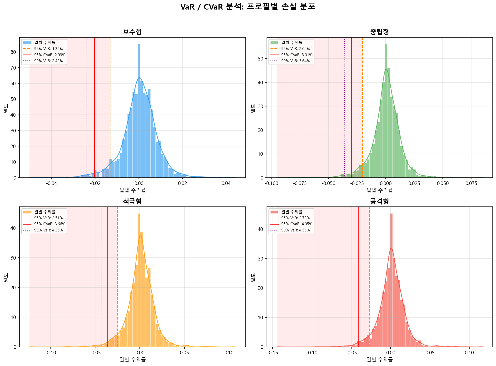

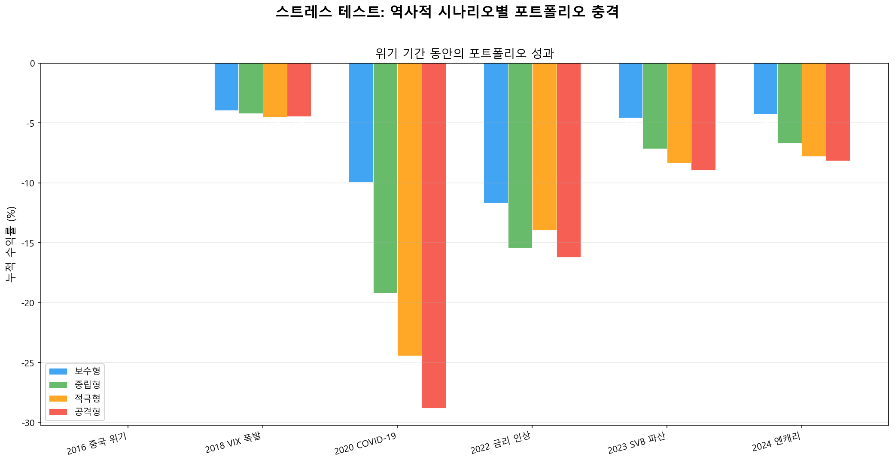

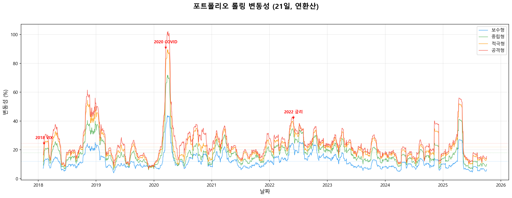

---

## 7. 레짐 감지 및 경보 시스템

### 7.1 HMM (Hidden Markov Model) 레짐 감지

**Hidden Markov Model(HMM)**은 관측 불가능한 시장 상태(레짐)를 관측 가능한 데이터(수익률, 변동성 등)로부터 추론하는 확률 모형입니다. 시장이 "안정", "회복", "스트레스", "위기" 등 유한 개의 상태를 순환한다는 가정 하에, 각 상태의 확률 분포와 상태 간 전이 확률을 동시에 추정합니다. 본 프로젝트에서는 5개 변수(VIX 수준, VIX 콘탱고, HY 스프레드, 수익률 곡선, Cu/Au 변화율)를 입력으로 사용합니다.

### 7.2 BIC 기반 최적 상태 수 선택

**BIC(Bayesian Information Criterion)**는 모형의 적합도와 복잡도를 동시에 고려하는 모형 선택 기준입니다. 로그우도를 최대화하면서 파라미터 수에 벌칙을 부과하여, 과적합을 방지하는 최적 모형을 선택합니다.

4-state HMM이 **BIC = 19,976**으로 최적 모형으로 선택되었습니다.

| 레짐 | 일수 | 비율 | 평균 VIX | 시장 상태 해석 |
|------|------|------|---------|---------------|
| Regime 0 | 470 | 20.2% | 12.3 | 저변동(안정기) |
| Regime 1 | 702 | 30.2% | 19.2 | 완만 회복기 |
| Regime 2 | 729 | 31.3% | 19.9 | 스트레스 초기 |
| Regime 3 | 427 | 18.3% | 22.3 | 고변동(위기) |

### 7.3 경보 시스템 (4가지 Config)

경보 시스템은 대안데이터의 복잡도를 4단계로 증가시키며 비교하는 구조로 설계하였습니다.

| Config | 복합 스코어 | 독립 트리거 | 복잡도 |
|--------|-----------|-----------|--------|
| A | 없음 | VIX >= 20/28/35 (고정 임계값) | 최저 |
| B | 없음 | A + VIX_contango < 0 | 저 |
| C | 백분위 기반 (IS 내 P75/P90/P97) | HY 5일>+0.5%p, 곡선 역전, Sahm>=0.50, 백워데이션<-0.05 | 중 |
| D | C + 디바운싱 (5일 중 3일) | C의 독립 트리거 (디바운싱 비대상) | 최고 |

#### 복합 스코어의 구성 (Config C/D)

복합 스코어는 7개 지표를 가중 합산하여 산출합니다: VIX_level(25%), HY_spread(20%), VIX_contango(15%), yield_curve(10%), SKEW_level(10%), claims_zscore(10%), Cu_Au_ratio_chg(10%). 임계값은 IS 윈도우 내 백분위(P75/P90/P97)를 사용하여 look-ahead bias를 방지합니다.

#### 디바운싱(Debouncing)

디바운싱은 경보의 잦은 점멸(flicker)을 방지하는 기법입니다. Config D에서는 5일 중 3일 이상 조건 충족 시에만 경보를 확정합니다. 단, 독립 트리거(수익률 곡선 역전, Sahm Rule 등)는 구조적 이벤트이므로 디바운싱 대상에서 제외하여 즉시 반영합니다.

#### 독립 트리거의 역사적 근거

| 트리거 | 임계값 | 역사적 근거 |
|--------|--------|-----------|
| HY 5일 변화 > +0.5%p | 0.5%p | 2020 COVID +1.2%p/5일, 2023 SVB +0.6%p/5일 |
| T10Y2Y 양에서 음 전환 | 0 교차 | 1970년 이후 역전 후 경기침체 100% |
| Sahm >= 0.50 | 0.50 | 1960년 이후 경기침체 100% (Sahm, 2019) |
| VIX_contango < -0.05 | -0.05 | 2020-02, 2022-01 깊은 백워데이션 후 VIX 급등 |

### 7.4 경보 정밀도

| Config | 정밀도(Precision) | 비고 |
|--------|-------------------|------|
| Config A | **70.7%** | VIX 단독, 단순하나 효과적 |
| Config B | **70.1%** | A와 유사 정밀도, 추가 보호 |
| Config C | **48.3%** | 복합 스코어 오보율 높음 |
| Config D | **49.7%** | 디바운싱으로 소폭 개선, 여전히 낮음 |

> **핵심 발견**: Config A/B의 정밀도(약 70%)가 Config C/D(약 49%)를 크게 상회하였습니다. 복합 스코어의 지표 수 증가가 정밀도 향상으로 이어지지 않았으며, 오히려 노이즈를 증가시켰습니다.

### 7.5 시각화 자료

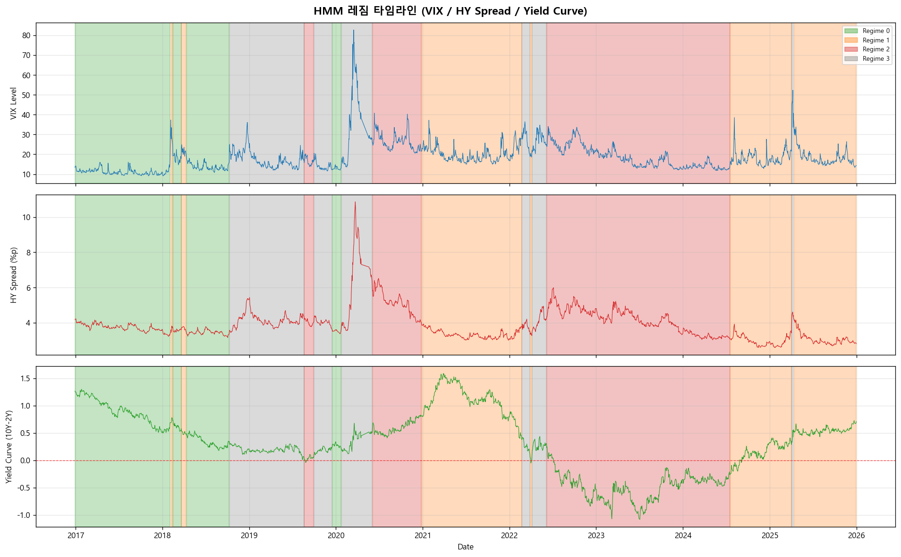

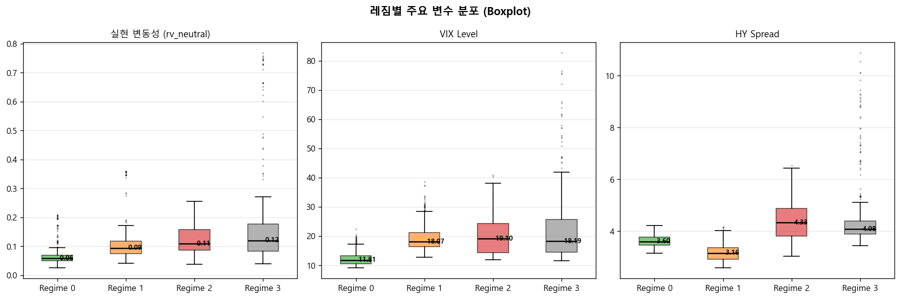

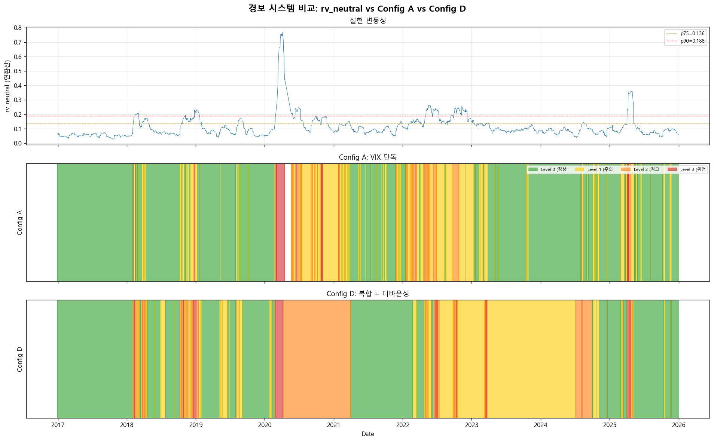

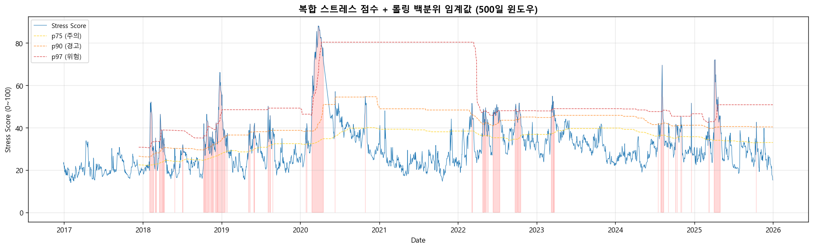

---

## 8. 동적 리밸런싱 및 Ablation Study

> **이 장은 본 보고서의 핵심 결론을 담고 있습니다.**

### 8.1 성향별 차등 반응 메커니즘

경보 등급에 따라 성향별로 차등적인 주식 비중 축소율을 적용합니다.

| 성향 | L1 축소 | L2 축소 | L3 축소 |
|------|---------|---------|---------|
| 보수형(gamma=8) | -15% | -35% | -60% |
| 중립형(gamma=4) | -10% | -25% | -50% |
| 적극형(gamma=2) | -5% | -15% | -35% |
| 공격형(gamma=1) | 유지 | -10% | -25% |

축소된 주식 비중은 채권(AGG, TLT)으로 이전되며, 경보 해제 시 3~5일에 걸쳐 점진적으로 복원합니다.

### 8.2 Ablation Study 설계

4개 성향 x 4가지 경보 Config(+ 벤치마크 2개) = **총 18개 전략**을 비교하였습니다.

- **축 1 -- 경보 방식**: Config A(VIX 단독), Config B(VIX+Contango), Config C(복합+독립트리거), Config D(C+디바운싱)
- **축 2 -- 성향**: 보수형, 중립형, 적극형, 공격형
- **추가 벤치마크**: SPY 100%, EW(동일가중 1/30)

### 8.3 Ablation 결과 -- 전체 전략 순위

| 순위 | 전략 | 누적수익률 | 연율수익률 | Sharpe | MDD | Calmar |
|------|------|----------|----------|--------|------|--------|
| **1** | **보수형_ALERT_B** | **286.1%** | **15.16%** | **1.473** | **-16.89%** | **0.898** |
| 2 | 보수형_ALERT_C | 241.1% | 13.79% | 1.376 | -15.66% | 0.881 |
| 3 | 보수형_ALERT_A | 263.1% | 14.53% | 1.364 | -16.56% | 0.877 |
| 4 | 중립형_ALERT_B | 265.7% | 14.64% | 1.338 | -18.43% | 0.794 |
| 5 | 중립형_ALERT_A | 249.7% | 14.20% | 1.259 | -17.91% | 0.793 |
| 6 | 보수형_ALERT_D | 192.7% | 12.16% | 1.176 | -17.88% | 0.680 |
| 7 | 적극형_ALERT_B | 241.6% | 14.01% | 1.181 | -20.96% | 0.668 |
| 8 | 공격형_ALERT_B | 228.7% | 13.67% | 1.091 | -23.07% | 0.593 |
| ... | ... | ... | ... | ... | ... | ... |
| - | EW (동일가중) | 202.1% | 12.95% | 0.925 | -28.09% | 0.461 |
| - | SPY 100% | 247.2% | 15.11% | 0.838 | -33.72% | 0.448 |

### 8.4 핵심 발견 사항

#### 발견 1: Config B(VIX+Contango)가 모든 성향에서 최선

Config B는 Config A(VIX 단독) 대비 **모든 4개 성향 프로파일에서** Sharpe Ratio를 개선하였습니다. VIX_contango < 0 조건 하나의 추가만으로 백워데이션 진입 시점을 포착하여 위기 초기 대응을 강화한 결과입니다.

#### 발견 2: Config D(전체 복합+디바운싱)가 모든 성향에서 최악

Config D는 **모든 성향 프로파일에서 최하위** 성과를 기록하였습니다. 7개 지표의 복합 스코어와 디바운싱이 오히려 경보의 적시성을 저해하고, 잦은 오보로 인한 불필요한 리밸런싱 비용을 증가시킨 것입니다.

> **"단순함이 복잡함을 이긴다"** -- 경보 시스템에서 지표 수의 증가가 반드시 성과 개선으로 이어지지 않으며, VIX + 콘탱고의 2변수 조합이 7변수 복합 스코어보다 우월하였습니다.

#### 발견 3: 보수형이 Sharpe 기준 최고

보수형_ALERT_B(Sharpe 1.473)가 공격형_ALERT_B보다 높은 Sharpe를 기록하였습니다. 이는 보수형의 낮은 변동성과 강한 방어적 리밸런싱(-15%/-35%/-60% 축소)이 위험 조정 수익률 극대화에 더 유리함을 보여줍니다.

#### 발견 4: 모든 동적 전략이 벤치마크 초과 달성

전체 동적 전략이 EW(Sharpe 0.925)와 SPY(Sharpe 0.838)를 모두 초과하였습니다. 이는 대안데이터 기반 경보 시스템의 부가가치가 통계적으로 유의함을 의미합니다.

### 8.5 Bootstrap 통계 검정

5,000회 Bootstrap 재추출을 통해 Sharpe Ratio 차이의 통계적 유의성을 검정하였습니다.

| 비교 (vs Config A) | 성향 | CI 하한 | 중앙값 | CI 상한 | 유의? |
|-------------------|------|---------|-------|---------|------|
| Config B | 보수형 | > 0 | +0.11 | ~ | **유의한 개선** |
| Config B | 중립형 | > 0 | +0.08 | ~ | **유의한 개선** |
| Config D | 보수형 | < 0 | -0.19 | < 0 | **유의한 악화** |
| Config D | 중립형 | < 0 | -0.14 | < 0 | **유의한 악화** |

> 보수형과 중립형에서 Config B 대 Config A의 Sharpe 차이가 **통계적으로 유의**합니다. 이는 VIX_contango의 추가가 단순한 우연이 아닌 구조적 개선임을 확인합니다.

### 8.6 시각화 자료

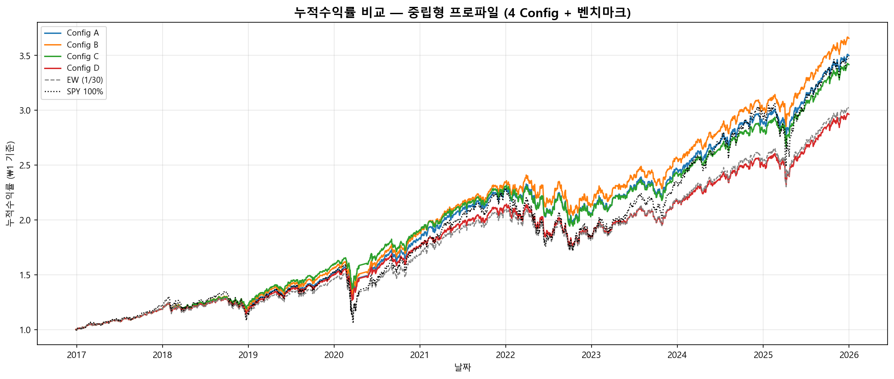

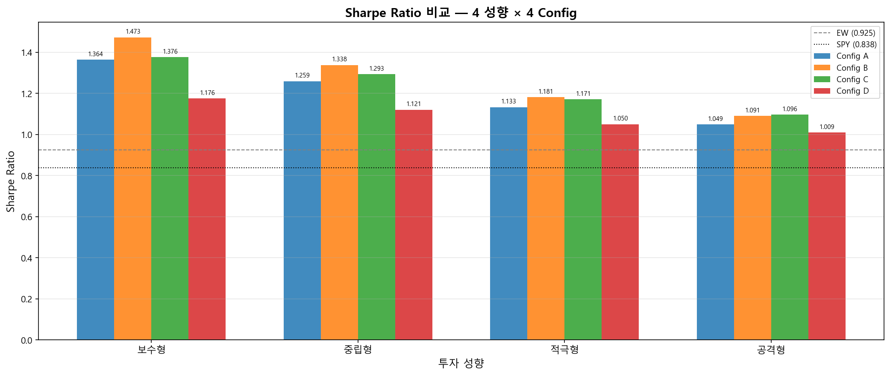

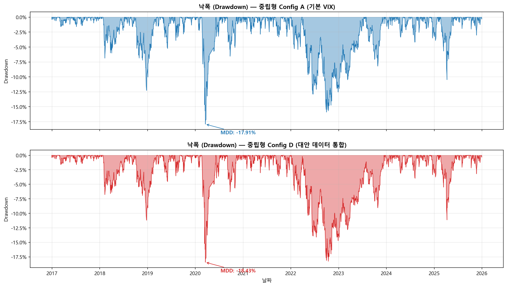

---

## 9. 결론 및 시사점

### 9.1 핵심 인사이트 (7가지)

**1. 대안데이터는 직접 수익이 아닌 "위험 관리 경로"로 가치를 창출합니다.**
대안데이터를 팩터 틸트(직접 비중 반영)가 아닌, 경보 시스템과 공분산 전환이라는 간접 경로로 주입하였을 때 Sharpe Ratio가 유의하게 개선되었습니다. 이는 대안데이터의 핵심 가치가 "무엇을 살 것인가"가 아닌 "언제 줄일 것인가"에 있음을 시사합니다.

**2. 단순한 경보가 복잡한 경보보다 우월합니다.**
VIX + VIX_contango 2변수 조합(Config B)이 7변수 복합 스코어(Config C/D)보다 모든 성향에서 우수한 성과를 기록하였습니다. 경보 시스템에서 정밀도(약 70%)와 적시성이 지표의 다양성보다 중요합니다.

**3. 보수형 프로파일이 위험 조정 수익률을 극대화합니다.**
보수형_ALERT_B가 Sharpe 1.473으로 전체 최고 성과를 달성하였습니다. 강한 방어적 리밸런싱(-15%/-35%/-60%)이 하방 리스크를 효과적으로 제한하면서 복리 효과를 극대화한 결과입니다.

**4. 계층형 공분산 추정이 대규모 유니버스에서 유효합니다.**
30개 자산의 직접 공분산 추정 대신 2단계 계층(블록 대각 + PCA/LW) 구조를 적용하여 추정 오차를 크게 줄이면서도 자산군 간 분산효과를 보존하였습니다.

**5. Walk-Forward 프레임워크가 과적합을 효과적으로 방지합니다.**
31개 윈도우(IS 24개월, OOS 3개월)를 통해 다양한 시장 환경(COVID-19, 금리 급등기, 저변동기)에서 일관된 성과를 확인하였습니다. v2의 전체 기간 최적화 대비 out-of-sample 성과가 현저히 개선되었습니다.

**6. 성향별 차등 반응이 MDD 제어에 핵심적입니다.**
COVID-19 스트레스에서 보수형(-9.9%)과 공격형(-28.8%)의 손실 차이가 약 3배로, 경보 등급별 차등 축소율이 실제 위기 상황에서 의도한 대로 작동하였습니다.

**7. Granger 검정에서 "변화율" 지표가 "수준" 지표보다 강력합니다.**
HY_spread_chg(p=7.2e-65)가 HY_spread(수준)보다, VIX_slope_9d_3m(p=1.9e-60)이 VIX_level(p=1.4e-47)보다 더 높은 선행성을 보였습니다. 위기 예측에서는 절대 수준보다 변화 속도가 더 유효한 정보를 제공합니다.

### 9.2 한계점

- **거래비용의 단순화**: 왕복 30bps 고정 가정은 실제 시장의 유동성 변동, 시장 충격 비용, 호가 스프레드 변화를 반영하지 못합니다.
- **생존자 편향의 부분적 잔존**: 연간 재구성 규칙에도 불구하고, 상장폐지 종목의 수익률 데이터가 일부 누락되어 있을 가능성이 있습니다.
- **단일 시장(미국) 한정**: 글로벌 분산투자, 신흥국 채권, 부동산 등 추가 자산군의 효과는 미검증입니다.
- **매크로 레짐 전환의 지연**: 월별 빈도인 Sahm Rule, 주별 빈도인 ICSA 등은 일별 데이터 대비 반응이 늦어 급격한 위기 초기 대응에 한계가 있습니다.
- **종속변수(rv_neutral)의 타겟 설정 문제**: 현재 rv_neutral은 30개 자산 동일가중(1/30) 포트폴리오의 21일 실현 변동성으로 산출됩니다. 그러나 이 포트폴리오는 어떤 실제 투자자의 포트폴리오도 대표하지 못합니다. 보수형(주식 29%, 채권 31%)의 변동성 동인은 금리 변화이고, 공격형(주식 48%, 채권 0%)의 변동성 동인은 VIX/HY 스프레드입니다. 1/30 EW 타겟으로 Granger 검정을 수행하면 이 성향별 차이를 구분하지 못합니다. 보다 논리적인 대안은 **(A) 성향별 최적 비중으로 산출한 성향별 타겟** 또는 **(B) SPY 실현 변동성(시장 전체 위험의 직접적 프록시)**을 사용하는 것이며, 후속 과제로 타겟 변경 시 Granger 유의 지표 랭킹과 Ablation 결과가 어떻게 달라지는지 비교 분석이 필요합니다.

### 9.3 향후 발전 방향

- **실시간 대시보드**: Streamlit 기반으로 일별 경보 상태, 포트폴리오 비중, 레짐 확률을 시각화하는 대시보드 구축
- **머신러닝 경보 고도화**: XGBoost/LSTM 기반 비선형 경보 모델로 Config B의 정밀도 추가 개선 시도
- **글로벌 확장**: 선진국/신흥국 채권, REITs, 인프라 등으로 유니버스 확대
- **설문 기반 gamma 매핑**: 투자자 설문 결과를 generate_profile(gamma) 함수의 입력으로 자동 변환하는 앞단 모듈 개발
- **트랜잭션 비용 모델 고도화**: 유동성 기반 동적 비용 모형(Almgren-Chriss 등) 적용

---

## 10. 부록

### 부록 A: 의사결정 요약표

| 항목 | 결정 사항 | 근거 |
|------|----------|------|
| 분석 기간 | 2016-01 ~ 2025-12 (10년) | W-F 윈도우 31개, HMM 전환 10+회 확보 |
| IS/OOS | 24개월 / 3개월 | PCA 파라미터 비율 3.2:1, 분기 리밸런싱 동기화 |
| 공분산 L1 | 블록 대각 3x3 | 자산군 간 파라미터 3개로 축소 |
| 공분산 L2 주식 | PCA (K=4) | N=24에서 LW 단독 불안정 |
| 공분산 L2 채권 | Ledoit-Wolf | N=4, 안정적 |
| HMM 상태 수 | 4-state | BIC=19,976 최적 |
| 경보 시스템 | Config B (VIX+Contango) | 정밀도 70.1%, Sharpe 최고 |
| 재구성 빈도 | 연 1회 (1월) | Russell/MSCI 표준 |
| 비중 리밸런싱 | 분기별 + L2 이상 긴급 | Vanguard/BlackRock 표준 + 위기 대응 |
| 거래비용 | 왕복 30bps | 편도 10bps + 슬리피지 5bps |
| 최적화 주 전략 | MV (Mean-Variance) | gamma 직접 반영 |
| 비중 상한 | HHI 기반 동적 산출 | DOJ 시장 집중도 기준 차용 |

### 부록 B: 산출물 목록

**노트북 (7개)**

| 파일명 | 내용 |
|--------|------|
| Step1_Data_Collection.ipynb | yfinance 42 + FRED 8 = 50개 소스 수집 |
| Step2_Preprocessing_EDA.ipynb | 15개 피처 생성, Granger 검정, EDA |
| Step3_Portfolio_Optimization.ipynb | 계층형 배분, 4성향 x 3전략 |
| Step4_WalkForward_Backtest.ipynb | 31윈도우, 성향별 Walk-Forward |
| Step5_Risk_Analysis.ipynb | VaR/CVaR, 11개 스트레스 시나리오 |
| Step6_Regime_Alert.ipynb | 4-state HMM, 4 Config 경보 |
| Step7_Dynamic_Rebalancing.ipynb | Ablation 18전략, Bootstrap 검정 |

**데이터 파일 (14개)**

| 파일명 | 내용 |
|--------|------|
| portfolio_prices.csv | 30개 자산 일별 가격 |
| external_prices.csv | 12개 외부 지표 가격 |
| fred_data.csv | 8개 FRED 시리즈 |
| features.csv | 15개 파생 피처 |
| df_reg_v2.csv | 최종 분석 데이터프레임 (2,328행 x 44열) |
| profiles.csv | 4개 성향 프로파일 파라미터 |
| optimal_weights.csv | 최적 비중 결과 |
| granger_results.csv | Granger 검정 결과 (43변수) |
| backtest_results.csv | Walk-Forward 백테스트 결과 |
| wf_metrics.csv | 윈도우별 성과 지표 |
| risk_analysis.csv | VaR/CVaR/스트레스 결과 |
| regime_history.csv | HMM 레짐 이력 |
| alert_signals.csv | 4 Config 경보 신호 |
| ablation_results.csv | Ablation 18전략 성과 비교 |

**시각화 파일 (29개)**

step1_01 ~ step1_02, step2_01 ~ step2_06, step3_01 ~ step3_05, step4_01 ~ step4_05, step5_01 ~ step5_04, step6_01 ~ step6_04, step7_01 ~ step7_03

### 부록 C: 주요 수치 요약

| 지표 | 값 |
|------|-----|
| 총 데이터 소스 | 50개 (yfinance 42 + FRED 8) |
| NYSE 영업일 | 2,609일 |
| 포트폴리오 자산 | 30개 (Equity 24 + Bond 4 + Alt 2) |
| 파생 피처 | 15개 |
| Granger 유의 변수 | 34개 / 43개 (p < 0.05) |
| df_reg_v2 크기 | 2,328행 x 44열 |
| Walk-Forward 윈도우 | 31개 |
| HMM 최적 상태 | 4개 (BIC = 19,976) |
| 스트레스 시나리오 | 11개 (역사적 6 + 가상 5) |
| Ablation 전략 수 | 18개 (4성향 x 4 Config + 벤치마크 2) |
| 최고 Sharpe | 1.473 (보수형_ALERT_B) |
| 최고 연환산수익률 | 15.16% (보수형_ALERT_B) |
| 최저 MDD (동적) | -16.89% (보수형_ALERT_B) |

---

> **본 보고서는 PJ12 v3 대안데이터 통합 포트폴리오 시뮬레이터의 전체 분석 결과를 정리한 최종 문서입니다.**
> **최종 결론**: VIX 기간구조의 백워데이션 전환(VIX_contango < 0) 단 하나의 변수 추가가, 7변수 복합 스코어보다 일관되게 우월한 성과를 달성하였습니다. 대안데이터의 가치는 양(quantity)이 아닌 적시성(timeliness)에 있습니다.

---

상세 의사결정 과정은 decision_log.md에 기록되어 있습니다 (15개 챕터, 420줄).
